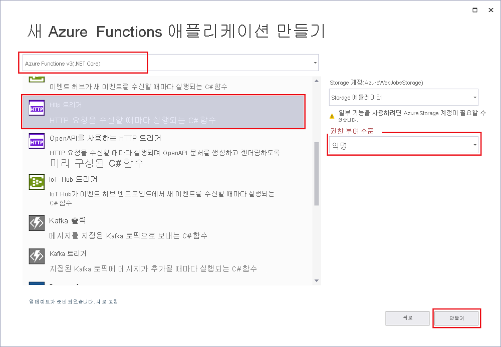

Visual Studio의 Azure Functions 프로젝트 템플릿은 Azure에서 함수 앱에 게시할 수 있는 프로젝트를 만듭니다. 함수 앱을 사용하면 함수를 논리 단위로 그룹화하여 더 쉽게 리소스를 관리, 배포, 크기 조정 및 공유할 수 있습니다.

1. Visual Studio 메뉴에서 **파일** > **새로 만들기** > **프로젝트**를 차례로 선택합니다.

1. **새 프로젝트 만들기**에서 검색 상자에 *함수*를 입력하고, **Azure Functions** 템플릿을 선택한 다음, **다음**을 선택합니다.

1. **새 프로젝트 구성**에서 프로젝트에 대한 **프로젝트 이름**을 입력한 다음, **만들기**를 선택합니다. 함수 앱 이름은 C# 네임스페이스로 유효해야 하므로 밑줄, 하이픈 또는 기타 영숫자가 아닌 문자는 사용하지 마세요.

1. **새 Azure 함수 애플리케이션** 설정에 대해서는 다음 표의 값을 사용합니다.

    | 설정      | 값  | Description                      |
    | ------------ |  ------- |----------------------------------------- |
    | **함수 런타임** | **Azure Functions v3  (.NET Core)** | 이 값은 .NET Core 3.x를 지원하는 Azure Functions의 버전 3.x 런타임을 사용하는 함수 프로젝트를 만듭니다. Azure Functions 1.x는 .NET Framework를 지원합니다. 자세한 내용은 [Azure Functions 런타임 버전 개요](../articles/azure-functions/functions-versions.md)를 참조하세요.   |
    | **함수 템플릿** | **HTTP 트리거** | 이 값은 HTTP 요청에 의해 트리거되는 함수를 만듭니다. |
    | **Storage 계정**  | **Storage 에뮬레이터** | Azure 함수에는 스토리지 계정이 필요하기 때문에 Azure에 프로젝트를 게시할 때 할당되거나 생성됩니다. HTTP 트리거는 Azure Storage 계정 연결 문자열을 사용하지 않습니다. 다른 모든 트리거 형식에는 유효한 Azure Storage 계정 연결 문자열이 필요합니다.  |
    | **액세스 권한** | **익명** | 만들어진 함수를 모든 클라이언트에서 키를 제공하지 않고 트리거할 수 있습니다. 이 권한 부여 설정을 통해 새 함수를 쉽게 테스트할 수 있습니다. 키 및 권한 부여에 대한 자세한 내용은 [권한 부여 키](../articles/azure-functions/functions-bindings-http-webhook-trigger.md#authorization-keys) 및 [HTTP 및 웹후크 바인딩](../articles/azure-functions/functions-bindings-http-webhook.md)을 참조하세요. |
    
    
    

    **액세스 권한**을 **익명**으로 설정해야 합니다. 기본 수준인 **Function**을 선택하면 함수 엔드포인트에 액세스하도록 요구하는 요청에 [함수 키](../articles/azure-functions/functions-bindings-http-webhook-trigger.md#authorization-keys)를 제공해야 합니다.

1. **만들기**를 선택하여 함수 프로젝트 및 HTTP 트리거 함수를 만듭니다.
