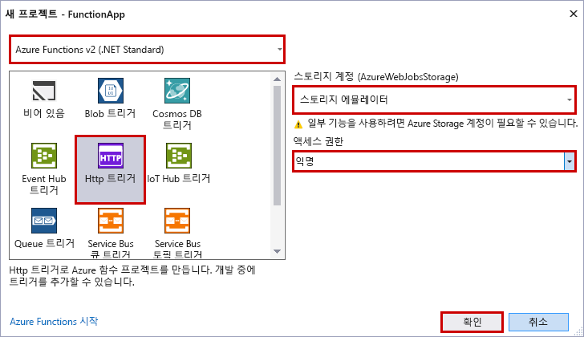

Visual Studio의 Azure Functions 프로젝트 템플릿은 Azure에서 함수 앱에 게시할 수 있는 프로젝트를 만듭니다. 함수 앱을 통해 함수를 논리적 단위로 그룹화하여 관리, 배포 및 리소스를 공유할 수 있습니다.

1. Visual Studio의 **파일** 메뉴에서 **새로 만들기** > **프로젝트**를 선택합니다.

2. **새 프로젝트** 대화 상자에서 **설치됨**을 선택하고 **Visual C#** > **클라우드**를 확장하고, **Azure Functions**를 선택하고, 프로젝트에 대한 **이름**을 입력하고, **확인**을 클릭합니다. 함수 앱 이름은 C# 네임스페이스로 유효해야 하므로 밑줄, 하이픈 또는 기타 영숫자가 아닌 문자는 사용하지 마세요.

    

3. 이미지 아래의 표에 지정된 설정을 사용합니다.

     

    | 설정      | 제안 값  | 설명                      |
    | ------------ |  ------- |----------------------------------------- |
    | **버전** | Azure Functions 2.x  (.NET Core) | 이 설정은 .NET Core를 지원하는 Azure Functions의 버전 2.x 런타임을 사용하는 함수 프로젝트를 만듭니다. Azure Functions 1.x는 .NET Framework를 지원합니다. 자세한 내용은 [Azure Functions 런타임 버전을 대상으로 지정하는 방법](../articles/azure-functions/functions-versions.md)을 참조하세요.   |
    | **템플릿** | HTTP 트리거 | 이 설정은 HTTP 요청에 의해 트리거되는 함수를 만듭니다. |
    | **Storage 계정**  | 저장소 에뮬레이터 | HTTP 트리거는 저장소 계정 연결을 사용하지 않습니다. 다른 모든 트리거 유형은 유효한 저장소 계정 연결 문자열이 필요합니다. |
    | **액세스 권한** | 익명 | 만들어진 함수를 모든 클라이언트에서 키를 제공하지 않고 트리거할 수 있습니다. 이 권한 부여 설정을 통해 새 함수를 쉽게 테스트할 수 있습니다. 키 및 권한 부여에 대한 자세한 내용은 [HTTP 및 웹후크 바인딩](../articles/azure-functions/functions-bindings-http-webhook.md)에서 [권한 부여 키](../articles/azure-functions/functions-bindings-http-webhook.md#authorization-keys)를 참조하세요. |
4. **확인**을 클릭하여 함수 프로젝트 및 HTTP 트리거 함수를 만듭니다.
