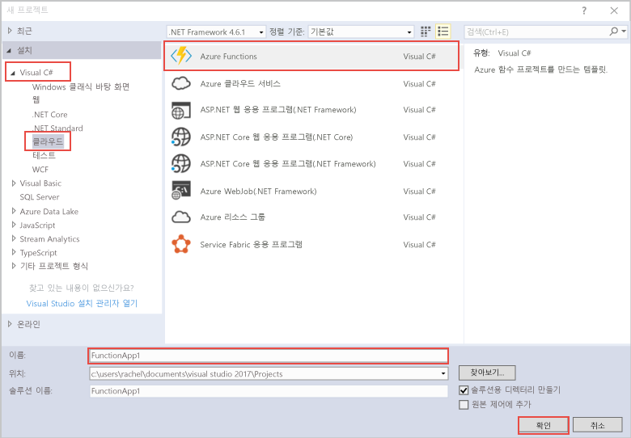

Visual Studio의 Azure Functions 프로젝트 템플릿은 Azure에서 함수 앱에 게시할 수 있는 프로젝트를 만듭니다. 함수 앱을 통해 함수를 논리 단위로 그룹화하여 더욱 쉽게 관리, 배포 및 리소스 공유할 수 있습니다.   

1. **솔루션 탐색기**에서 프로젝트 노드를 마우스 오른쪽 단추로 클릭하고 **추가** > **새 항목**을 차례로 선택합니다. 대화 상자에서 **Azure 함수**를 선택합니다.

2. **새 프로젝트** 대화 상자에서 **Visual C#** > **클라우드** 노드를 펼치고, **Azure Functions**를 선택하고, 프로젝트에 대한 **이름**을 입력하고, **확인**을 클릭합니다. 함수 앱 이름은 C# 네임스페이스로 유효해야 하므로 밑줄, 하이픈 또는 기타 영숫자가 아닌 문자는 사용하지 마세요. 

    