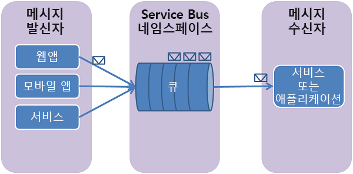

## Service Bus 큐 정의
Service Bus 큐는 **조정된 메시징** 통신 모델을 지원합니다. 큐를 사용하는 경우 분산 응용 프로그램의 구성 요소가 서로 직접 통신하지 않고 중간자(브로커) 역할을 하는 큐를 통해 메시지를 교환합니다. 메시지 생산자(보낸 사람)는 메시지를 큐로 전달한 후 계속해서 처리합니다. 메시지 소비자(받는 사람)는 비동기적으로 큐에서 메시지를 끌어와서 처리합니다. 생산자는 계속해서 추가 메시지를 처리하고 보내기 위해 소비자의 회신을 기다릴 필요가 없습니다. 큐는 하나 이상의 경쟁 소비자에게 **FIFO(선입선출)** 메시지 배달을 제공합니다. 즉, 일반적으로 메시지가 큐에 추가된 순서대로 받는 사람이 메시지를 받고 처리하며, 각 메시지가 하나의 메시지 소비자에 의해서만 수신 및 처리됩니다.

Service Bus 큐는 다양한 시나리오에 사용할 수 있는 범용 기술입니다.

* 다층 계층 Azure 응용 프로그램에서 웹 역할과 작업자 역할 간의 통신
* 하이브리드 솔루션에서 온-프레미스 앱과 Azure 호스팅 앱 간의 통신
* 서로 다른 조직이나 조직의 부서에서 온-프레미스로 실행되는 분산 응용 프로그램 구성 요소 간의 통신

큐를 사용하면 응용 프로그램 규모를 보다 쉽게 규모를 조정할 수 있으며, 아키텍처의 복원력을 증가시킬 수 있습니다.

