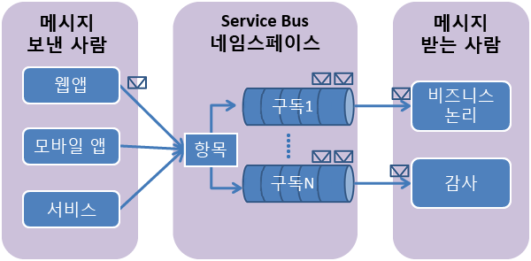

## Service Bus 토픽 및 구독 정의
Service Bus 토픽 및 구독은 *게시/구독* 메시징 통신 모델을 지원합니다. 토픽 및 구독을 사용하는 경우 분산 애플리케이션의 구성 요소가 서로 직접 통신하지 않고 중간자 역할을 하는 토픽을 통해 메시지를 교환합니다.

각 메시지가 단일 소비자에 의해 처리되는 Service Bus 큐와는 반대로, 토픽과 구독은 게시/구독 패턴을 사용하여 “일 대 다” 형태의 통신을 제공합니다. 하나의 토픽에 여러 구독을 등록할 수 있습니다. 토픽에 메시지를 전송하면 각 구독에서 독립적으로 처리할 수 있습니다.

토픽 구독은 토픽에 전송된 메시지의 복사본을 받는 가상 큐와 유사합니다. 필요에 따라 구독 단위로 토픽에 대한 필터 규칙을 등록할 수 있습니다. 필터 규칙을 사용하면 토픽 구독에 따라 토픽에 수신되는 메시지를 필터링 또는 제한할 수 있습니다.

Service Bus 토픽 및 구독을 사용하면 다수의 사용자와 애플리케이션에 대해 많은 메시지를 확장하고 처리할 수 있습니다.

[Azure portal]: https://portal.azure.com
[create-namespace]: ./media/howto-service-bus-topics/create-namespace.png
[connection-info]: ./media/howto-service-bus-topics/connection-info.png
[connection-string]: ./media/howto-service-bus-topics/connection-string.png

