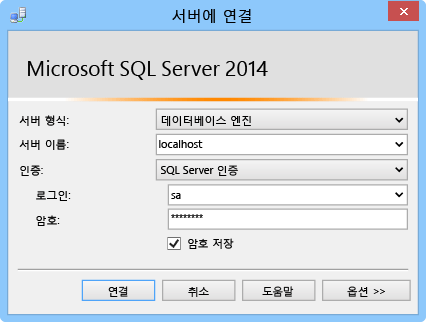

이 섹션에서는 SQL Server Express를 설치하고 TCP/IP를 활성화하고 정적 포트를 설정하고 하이브리드 연결과 함께 사용할 수 있는 데이터베이스를 생성하는 방법을 보여줍니다.  

### SQL Server Express 설치
하이브리드 연결을 사용하여 온-프레미스 SQL Server 또는 SQL Server Express 데이터베이스를 사용하려면 TCP/IP를 고정 포트에서 사용할 수 있어야 합니다. SQL Server의 기본 인스턴스에서는 고정 포트 1433을 사용하는 반면 명명된 인스턴스에서는 이 포트를 사용하지 않습니다. 이러한 이유 때문에 기본 인스턴스를 설치하겠습니다. 이미 SQL Server Express의 기본 인스턴스가 설치되어 있다면 이 섹션을 건너뛸 수 있습니다.

1. SQL Server Express를 설치하기 위해 다운로드한 **SQLEXPRWT_x64_ENU.exe** 또는 **SQLEXPR_x86_ENU.exe** 파일을 실행합니다. SQL Server 설치 센터 마법사가 나타납니다.
2. **새 SQL Server 독립 실행형 설치 또는 기존 설치에 기능 추가**를 클릭한 다음 **인스턴스 구성** 페이지가 나타날 때까지 지침에 따라 기본 선택 및 설정을 수락합니다.
3. **인스턴스 구성** 페이지에서 **기본 인스턴스**를 선택하고 **서버 구성** 페이지에서 기본 설정을 수락합니다.
   
   > [!NOTE]
   > 이미 SQL Server의 기본 인스턴스가 설치되어 있다면 다음 섹션으로 건너뛰어서 Hybrid Connection과 함께 이 인스턴스를 사용할 수 있습니다. 
   > 
   > 
4. **데이터베이스 엔진 구성** 페이지의 **인증 모드**에서 **혼합 모드(SQL Server 인증 및 Windows 인증)**를 선택하고 기본 제공 **sa** 관리자 계정에 대한 보안 암호를 입력합니다.
   
    이 자습서에서는 SQL Server 인증을 사용합니다. 나중에 필요하므로, 입력하는 암호는 기억해 두어야 합니다.
5. 마법사를 끝내서 설치를 완료합니다.

### TCP/IP 사용 및 정적 포트 설정
이 섹션에서는 SQL Server Express를 설치할 때 설치된 SQL Server 구성 관리자를 사용하여 TCP/IP를 사용하고 정적 IP 주소를 설정합니다. 

1. [SQL Server에 대한 TCP/IP 네트워크 프로토콜 사용](http://technet.microsoft.com/library/hh231672%28v=sql.110%29.aspx) 에 있는 단계를 따라 인스턴스에 대한 TCP/IP 액세스를 사용합니다.
2. (선택 사항) 기본 인스턴스를 사용할 수 없다면 [특정 TCP 포트로 수신하도록 서버 구성 ](https://msdn.microsoft.com/library/ms177440.aspx) 의 단계를 따라 인스턴스에 대한 정적 포트를 설정합니다. 이 단계를 완료하면 포트 1433 대신에 정의하는 새 포트를 사용하여 연결됩니다.
3. (선택 사항) 필요한 경우 SQL Server 프로세스 (sqlservr.exe)에 원격 액세스를 허용하도록 방화벽에서 예외를 추가합니다.

### 온-프레미스 SQL Server 인스턴스에 새 데이터베이스 만들기
1. SQL Server Management Studio에서 방금 설치한 SQL Server에 연결합니다. (**서버에 연결** 대화 상자가 자동으로 나타나지 않으면 왼쪽 창의 **개체 탐색기**로 이동하여 **연결**을 클릭한 후 **데이터베이스 엔진**을 클릭합니다.)     
   
    
   
    **서버 유형**으로 **데이터베이스 엔진**을 선택합니다. **서버 이름**으로 **localhost** 또는 SQL Server를 설치한 컴퓨터의 이름을 사용할 수 있습니다. **SQL Server 인증**을 선택한 다음 앞서 만든 sa 로그인에 대한 암호를 입력합니다. 
2. SQL Server Management Studio를 사용하여 새 데이터베이스를 만들려면 개체 탐색기에서 **데이터베이스**를 마우스 오른쪽 단추로 클릭한 다음 **새 데이터베이스**를 클릭합니다.
3. **새 데이터베이스** 대화 상자에 `OnPremisesDB`를 입력하고 **확인**을 클릭합니다. 
4. 개체 탐색기에서 **데이터베이스**를 확장하면 새로운 데이터베이스가 생성된 것을 볼 수 있습니다.

### 새 SQL Server 로그인 만들기 및 사용 권한 설정
마지막으로 제한된 권한으로 새 SQL Server 로그인을 만듭니다. Azure 서비스는 서버에 대한 모든 권한을 가진 기본 제공 sa 로그인 대신 이 로그인을 사용하여 온-프레미스 SQL Server에 연결합니다.

1. SQL Server Management Studio 개체 탐색기에서 마우스 오른쪽 단추로 **OnPremisesDB** 데이터베이스를 클릭하고 **새 쿼리**를 클릭합니다.
2. 다음 TSQL 쿼리를 쿼리 창에 붙여넣습니다.
   
       USE [master]
       GO
   
       /* Replace the PASSWORD in the following statement with a secure password. 
          If you save this script, make sure that you secure the file to 
          securely maintain the password. */ 
       CREATE LOGIN [HybridConnectionLogin] WITH PASSWORD=N'<**secure_password**>', 
           DEFAULT_DATABASE=[OnPremisesDB], DEFAULT_LANGUAGE=[us_english], 
           CHECK_EXPIRATION=OFF, CHECK_POLICY=ON
       GO
   
       USE [OnPremisesDB]
       GO
   
       CREATE USER [HybridConnectionLogin] FOR LOGIN [HybridConnectionLogin] 
       WITH DEFAULT_SCHEMA=[dbo]
       GO
   
       GRANT CONNECT TO [HybridConnectionLogin]
       GRANT CREATE TABLE TO [HybridConnectionLogin]
       GRANT CREATE SCHEMA TO [HybridConnectionLogin]
       GO  
3. 위의 스크립트에서 `<**secure_password**>` 문자열을 새 *HybridConnectionsLogin*에 대한 보안 암호로 대체합니다.
4. **실행** 하여 새 로그인을 만들고 온-프레미스 데이터베이스에 필요한 권한을 부여합니다.

<!--HONumber=Jan17_HO3-->

