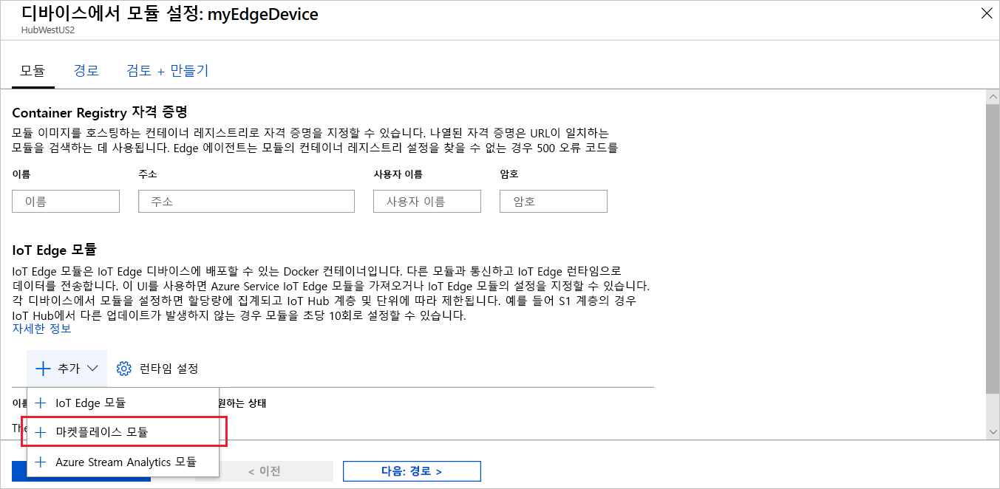
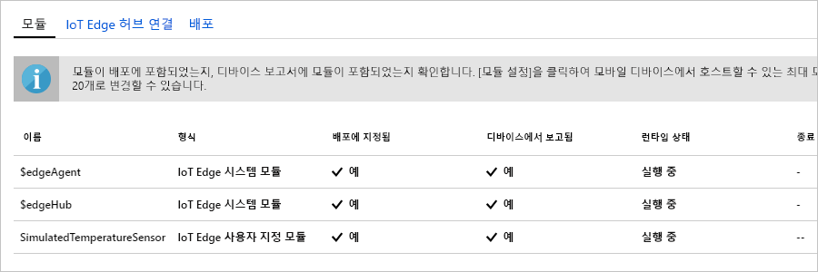

Azure IoT Edge의 주요 기능 중 하나는 클라우드의 IoT Edge 디바이스에 코드를 배포하는 것입니다. **IoT Edge 모듈**은 컨테이너로 구현된 실행 패키지입니다. 이 섹션에서는 [Azure Marketplace의 IoT Edge 모듈 섹션](https://azuremarketplace.microsoft.com/marketplace/apps/category/internet-of-things?page=1&subcategories=iot-edge-modules)에서 미리 빌드된 모듈을 배포합니다. 

이 섹션에서 배포하는 모듈은 센서를 시뮬레이션하고 생성된 데이터를 보냅니다. 이 모듈은 시뮬레이션된 데이터를 개발 및 테스트에 사용할 수 있으므로 IoT Edge를 시작할 때 유용한 코드 조각입니다. [시뮬레이션된 온도 센서 소스 코드](https://github.com/Azure/iotedge/blob/027a509549a248647ed41ca7fe1dc508771c8123/edge-modules/SimulatedTemperatureSensor/src/Program.cs)를 보면 이 모듈이 하는 일을 정확하게 이해할 수 있습니다. 

Azure Marketplace에서 첫 번째 모듈을 배포하려면 다음 단계를 수행합니다.

1. [Azure Portal](https://portal.azure.com)의 검색 상자에 **시뮬레이션된 온도 센서**를 입력하고 Marketplace 결과를 엽니다.

   

2. 이 모듈을 수신할 IoT Edge 디바이스를 선택합니다. **IoT Edge 모듈의 대상 디바이스** 페이지에서 다음 정보를 입력합니다.

   1. **구독**: 사용 중인 IoT 허브가 포함된 구독을 선택합니다.

   2. **IoT Hub**: 사용 중인 IoT 허브의 이름을 선택합니다.

   3. **IoT Edge 디바이스 이름**: 이 빠른 시작의 앞부분에 제안된 디바이스 이름을 사용한 경우 **myEdgeDevice**를 입력합니다. 그렇지 않은 경우 **디바이스 찾기**를 선택하여 IoT Hub에 있는 IoT Edge 디바이스 목록에서 선택합니다. 
   
   4. **만들기**를 선택합니다.

3. Azure Marketplace에서 IoT Edge 모듈을 선택하고 모듈을 수신할 IoT Edge 디바이스를 선택하면 모듈 배포 방법을 정확하게 정의할 수 있는 3단계 마법사로 이동됩니다. 마법사의 **모듈 추가** 단계에서 **SimulatedTemperatureSensor** 모듈이 자동으로 채워지는 것에 유의합니다. 자습서의 이 페이지를 사용하여 배포에 모듈을 추가합니다. 이 빠른 시작에서는 이 모듈 하나만 배포합니다. **다음**을 선택하여 마법사의 다음 단계로 진행합니다.

4. 마법사의 **경로 지정** 단계에서 모듈과 IoT Hub 사이에서 메시지가 전달되는 방식을 정의합니다. 빠른 시작의 경우, 모든 모듈의 모든 메시지가 IoT Hub(`$upstream`)로 이동하도록 합니다. 자동으로 채워지지 않으면 다음 코드를 추가한 후에 **다음**을 선택합니다.

   ```json
    {
    "routes": {
        "route": "FROM /messages/* INTO $upstream"
        }
    }
   ```

5. 마법사의 **배포 검토** 단계에서 IoT Edge 디바이스에 배포되는 모든 모듈을 정의하는 JSON 파일을 검토할 수 있습니다. **SimulatedTemperatureSensor** 모듈 외에도 **edgeAgent**와 **edgeHub**라는 시스템 모듈 두 개가 추가로 포함됩니다. 검토를 완료하면 **제출**을 선택합니다.

   IoT Edge 디바이스에 새 배포를 제출할 때는 디바이스에 아무것도 푸시되지 않습니다. 대신 디바이스가 IoT Hub에 새로운 지침이 있는지를 정기적으로 쿼리합니다. 디바이스는 업데이트된 배포 매니페스트를 찾으면 새 배포에 대한 정보를 사용하여 클라우드에서 모듈 이미지를 끌어온 다음, 모듈을 로컬로 실행하기 시작합니다. 이 프로세스에 몇 분 정도 걸릴 수 있습니다. 

6. 모듈 배포 세부 정보를 제출하면 마법사는 IoT 허브의 **IoT Edge** 페이지로 돌아갑니다. IoT Edge 디바이스 목록에서 디바이스를 선택하면 세부 정보를 볼 수 있습니다. 

7. 디바이스 세부 정보 페이지에서 **모듈** 섹션까지 아래로 스크롤합니다. 세 가지 모듈 즉, $edgeAgent, $edgeHub, SimulatedTemperatureSensor가 나열되어 있습니다. 하나 이상의 모듈이 배포에 지정된 대로 나열되지만 디바이스를 통해 보고되지 않으면 IoT Edge 디바이스에서 아직 모듈을 시작하는 중입니다. 몇 분 정도 기다린 후 페이지 맨 위에서 **새로 고침**을 선택합니다. 

   
