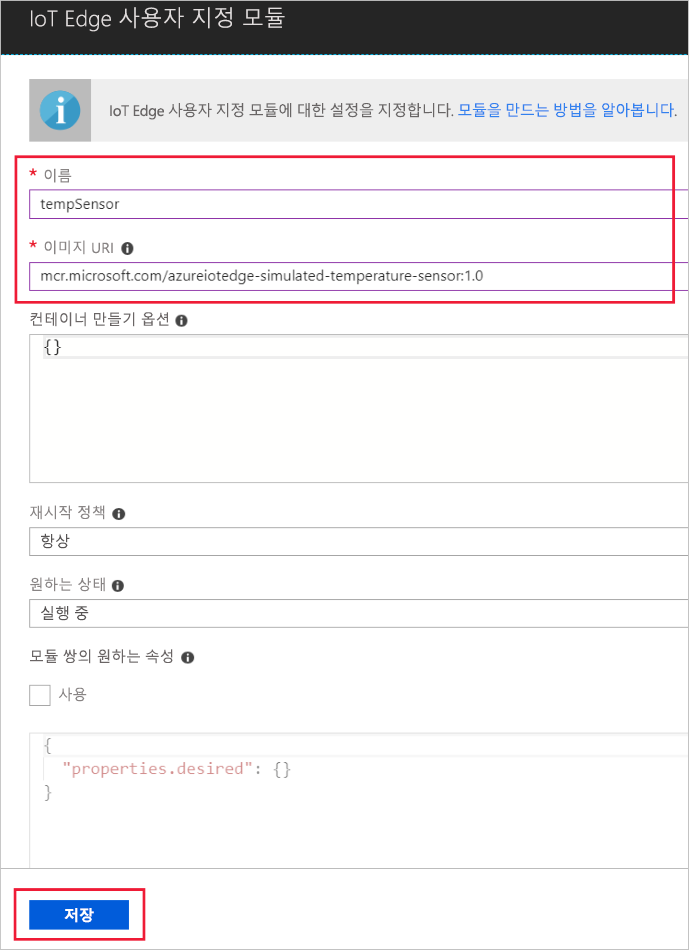

Azure IoT Edge의 주요 기능 중 하나는 클라우드에서 IoT Edge 장치에 모듈을 배포할 수 있다는 것입니다. IoT Edge 모듈은 컨테이너로 구현되는 실행 가능한 패키지입니다. 이 섹션에서는 시뮬레이트된 장치에 대한 원격 분석을 생성하는 모듈을 배포합니다. 

1. Azure Portal에서 IoT Hub로 이동합니다.
1. **IoT Edge**로 이동하여 IoT Edge 장치를 선택합니다.
1. **모듈 설정**을 선택합니다.
1. 페이지의 **배포 모듈** 섹션에서 **추가**를 클릭한 다음, **IoT Edge 모듈**을 선택합니다.
1. **이름** 필드에 `tempSensor`을 입력합니다. 
1. **이미지 URI** 필드에 `mcr.microsoft.com/azureiotedge-simulated-temperature-sensor:1.0`를 입력합니다. 
1. 다른 설정은 변경하지 않고 **저장**을 선택합니다.

   

1. **모듈 추가** 단계로 돌아가서 **다음**을 선택합니다.
1. **경로 지정** 단계에서 모든 메시지를 모든 모듈에서 IoT Hub로 보내는 기본 경로가 있어야 합니다. 그렇지 않은 경우 다음 코드를 추가한 다음, **다음**을 선택합니다.

   ```json
   {
       "routes": {
           "route": "FROM /messages/* INTO $upstream"
       }
   }
   ```

1. **배포 검토** 단계에서 **제출**을 선택합니다.
1. 장치 세부 정보 페이지로 돌아가서 **새로 고침**을 선택합니다. 서비스를 처음 시작할 때 만들어진 edgeAgent 모듈 외에도 **edgeHub**라는 다른 런타임 모듈 및 **tempSensor** 모듈이 나열되어야 합니다. 

   
