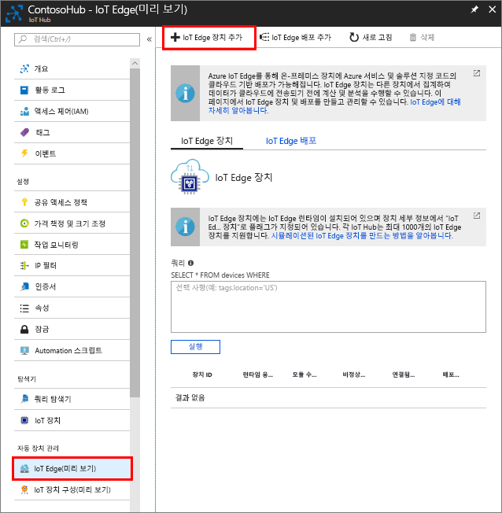

IoT Hub와 통신할 수 있도록, 시뮬레이션된 디바이스의 디바이스 ID를 만듭니다. IoT Edge 디바이스는 일반적인 IoT 디바이스와 다르게 작동하며 다른 방식으로 관리될 수 있으므로, 처음부터 IoT Edge 디바이스로 선언합니다. 

1. Azure Portal에서 IoT Hub로 이동합니다.
1. **IoT Edge**를 선택한 다음, **IoT Edge 디바이스 추가**를 선택합니다.

   

1. 시뮬레이트된 디바이스에 고유한 디바이스 ID를 제공합니다.
1. **저장**을 선택하여 디바이스를 추가합니다.
1. 디바이스 목록에서 새 디바이스를 선택합니다.
1. **연결 문자열—기본 키**의 값을 복사하여 저장합니다. 다음 섹션에서 이 값을 사용하여 IoT Edge 런타임을 구성할 것입니다. 

