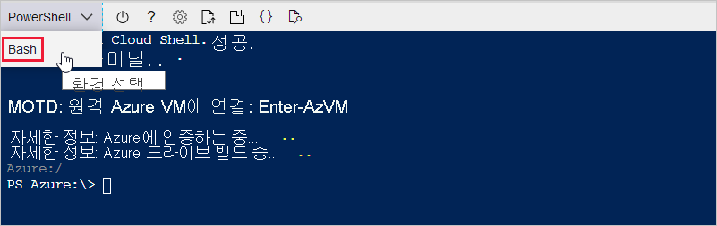

다음 섹션에서는 터미널을 설정하고 Azure CLI를 사용하여 IoT 허브를 만듭니다. Azure CLI 명령을 실행하는 터미널을 구성하려면 브라우저 기반 Azure Cloud Shell을 사용하거나 로컬 터미널을 사용할 수 있습니다.
* Cloud Shell을 사용하려면 [Cloud Shell 시작](#launch-the-cloud-shell) 섹션으로 이동합니다. 
* 로컬 터미널을 사용하려면 다음 섹션을 건너뛰고 [로컬 터미널 열기](#open-a-local-terminal)로 이동합니다.

## <a name="launch-the-cloud-shell"></a>Cloud Shell 시작
이 섹션에서는 Cloud Shell 세션을 만들고 터미널 환경을 구성합니다.

https://portal.azure.com 에서 Azure Portal에 로그인합니다.  

Cloud Shell을 시작하려면 다음을 수행합니다.

1. Azure Portal 오른쪽 위에 있는 메뉴 모음에서 **Cloud Shell** 단추를 선택합니다. 

    

    > [!NOTE]
    > Cloud Shell을 처음 사용하는 경우 Cloud Shell을 사용하는 데 필요한 스토리지를 만들라는 메시지가 표시됩니다.  구독을 선택하여 스토리지 계정 및 Microsoft Azure Files 공유를 만듭니다. 

2. **환경 선택** 드롭다운에서 원하는 CLI 환경을 선택합니다. 이 빠른 시작에서는 **Bash** 환경을 사용합니다. 다음 CLI 명령은 모두 PowerShell 환경에서도 작동합니다. 

    

3. 다음 섹션을 건너뛰고 [Azure IoT 확장 설치](#install-the-azure-iot-extension)로 이동합니다. 

## <a name="open-a-local-terminal"></a>로컬 터미널 열기
Cloud Shell이 아닌 로컬 터미널을 사용하기로 선택한 경우 이 섹션을 완료합니다.  

1. 로컬 터미널을 엽니다.
1. [az login](/cli/azure/reference-index#az_login) 명령을 실행합니다.

   ```azurecli
   az login
   ```

    CLI는 기본 브라우저를 열 수 있으면 기본 브라우저를 열고 Azure 로그인 페이지를 로드합니다.

    그렇지 않으면 https://aka.ms/devicelogin 에서 브라우저 페이지를 열고 터미널에 표시된 권한 부여 코드를 입력합니다.

    웹 브라우저를 사용할 수 없거나 웹 브라우저가 열리지 않으면 `az login --use-device-code`와 함께 디바이스 코드 흐름을 사용합니다.

1. 브라우저에서 계정 자격 증명으로 로그인합니다.

    다른 인증 방법에 대한 자세한 내용은 [Azure CLI로 로그인]( /cli/azure/authenticate-azure-cli )을 참조하세요.

1. [Azure IoT 확장 설치](#install-the-azure-iot-extension) 섹션으로 이동합니다. 

## <a name="install-the-azure-iot-extension"></a>Azure IoT 확장 설치
이 섹션에서는 Azure CLI용 Microsoft Azure IoT 확장을 CLI 셸에 설치합니다. IOT 확장은 Azure CLI에 IoT Hub, IoT Edge 및 IoT DPS(Device Provisioning Service) 고유의 명령을 추가합니다.

> [!IMPORTANT]
> 이 빠른 시작의 나머지 부분에 있는 터미널 명령은 Cloud Shell 또는 로컬 터미널에서 동일하게 작동합니다. 명령을 실행하려면 **복사** 를 선택하여 이 빠른 시작에서 코드 블록을 복사합니다. 그런 다음, CLI 셸에 붙여넣고 실행합니다.

[az extension add](/cli/azure/extension#az-extension-add) 명령을 실행합니다. 

   ```azurecli
   az extension add --name azure-iot
   ```
[!INCLUDE [iot-hub-cli-version-info](iot-hub-cli-version-info.md)]

## <a name="create-an-iot-hub"></a>IoT Hub 만들기
이 섹션에서는 Azure CLI를 사용하여 IoT 허브 및 리소스 그룹을 만듭니다.  Azure 리소스 그룹은 Azure 리소스가 배포 및 관리되는 논리적 컨테이너입니다. IoT 허브는 IoT 애플리케이션과 디바이스 간의 양방향 통신을 위한 중앙 메시지 허브 역할을 합니다. 

IoT 허브 및 리소스 그룹을 만들려면 다음을 수행합니다.

1. [az group create](/cli/azure/group#az-group-create)를 실행하여 리소스 그룹을 만듭니다. 다음 명령은 *eastus* 위치에 *MyResourceGroup* 이라는 리소스 그룹을 만듭니다. 
    >[!NOTE]
    > 선택적으로 대체 위치를 설정할 수 있습니다. 사용 가능한 위치를 보려면 `az account list-locations`를 실행합니다. 이 자습서에서는 예제 명령에 표시된 대로 *eastus* 를 사용합니다. 

    ```azurecli
    az group create --name MyResourceGroup --location eastus
    ```

1. [az iot hub create](/cli/azure/iot/hub#az-iot-hub-create) 명령을 사용하여 IoT Hub를 만듭니다. IoT Hub를 만드는 데 몇 분 정도 걸릴 수 있습니다. 

    *YourIotHubName*. IoT 허브에 대해 선택한 이름을 사용하여 다음 명령에서 이 자리 표시자와 주변 중괄호를 바꿉니다. IoT Hub 이름은 Azure에서 전역적으로 고유해야 합니다. 자리 표시자가 표시될 때마다 이 빠른 시작의 나머지 부분에서 IoT 허브 이름을 사용합니다.

    ```azurecli
    az iot hub create --resource-group MyResourceGroup --name {YourIoTHubName}
    ```

## <a name="create-a-simulated-device"></a>시뮬레이션된 디바이스 만들기
이 섹션에서는 IoT 허브에 연결되어 시뮬레이션된 IoT 디바이스를 만듭니다. 

시뮬레이션된 디바이스를 만들려면 다음을 수행합니다.
1. CLI 셸에서 [az iot hub device-identity create](/cli/azure/ext/azure-iot/iot/hub/device-identity#ext-azure-iot-az-iot-hub-device-identity-create) 명령을 실행합니다. 시뮬레이트된 디바이스 ID가 만들어집니다. 

    *YourIotHubName*. 이 자리 표시자를 IoT 허브용으로 선택한 이름으로 바꿉니다. 

    *myDevice*. 이 문서의 나머지 부분에서 시뮬레이트된 디바이스 ID에 이 이름을 직접 사용할 수 있습니다. 필요에 따라 다른 이름을 사용합니다. 

    ```azurecli
    az iot hub device-identity create --device-id myDevice --hub-name {YourIoTHubName} 
    ```

1.  [Az iot hub device-identity connection-string show](/cli/azure/ext/azure-iot/iot/hub/device-identity/connection-string#ext_azure_iot_az_iot_hub_device_identity_connection_string_show) 명령을 실행합니다. 

    ```azurecli
    az iot hub device-identity connection-string show --device-id myDevice --hub-name {YourIoTHubName}
    ```

    연결 문자열 출력은 다음 형식입니다.

    ```Output
    HostName=<your IoT Hub name>.azure-devices.net;DeviceId=<your device id>;SharedAccessKey=<some value>
    ```

1. 연결 문자열을 안전한 위치에 저장합니다. 

> [!NOTE]
> CLI 셸을 열어 둡니다. 이후 단계에서 사용합니다.