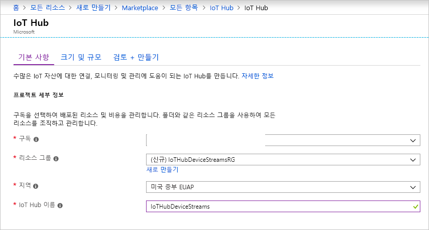
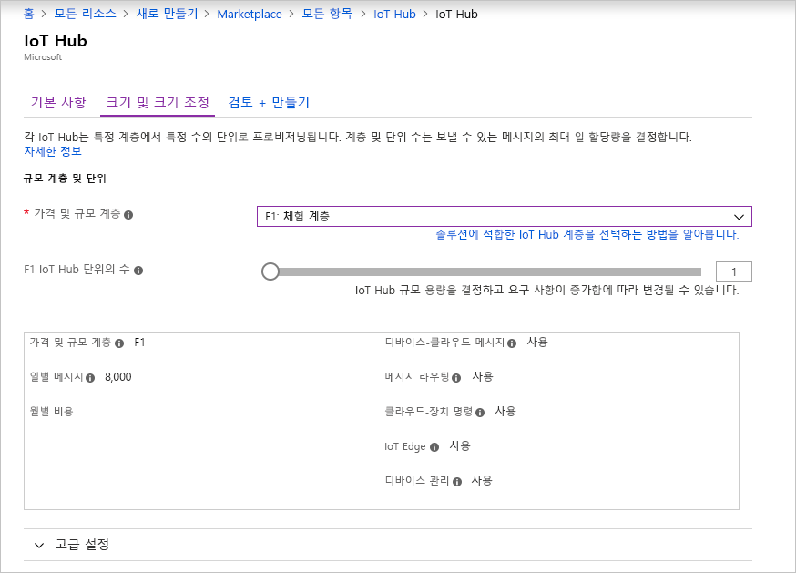
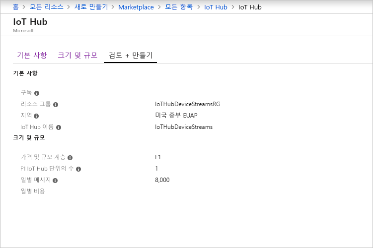

이 섹션에서는 [Azure Portal](https://portal.azure.com)을 사용하여 IoT Hub를 만드는 방법을 설명합니다.

1. [Azure Portal](https://portal.azure.com)에 로그인합니다.

1. **리소스 만들기**를 선택한 다음, **사물 인터넷**을 선택합니다.

1. 오른쪽 목록에서 **IoT Hub**를 선택합니다. IoT Hub를 만드는 첫 번째 페이지가 열립니다.

   

   다음 필드를 입력합니다.

   a. **구독** 드롭다운 목록에서 IoT Hub에 사용할 구독을 선택합니다.

   b. **리소스 그룹**에서 다음 중 하나를 수행합니다. 
      * 새 리소스 그룹을 만들려면 **새로 만들기**를 선택하고 사용하려는 이름을 입력합니다. 
      * 기존 리소스 그룹을 사용하려면 **기존 항목 사용**을 선택한 다음, 드롭다운 목록에서 리소스 그룹을 선택합니다. 
      
        자세한 내용은 [Azure Resource Manager 리소스 그룹 관리](../articles/azure-resource-manager/manage-resource-groups-portal.md)를 참조하세요.

   다. **Azure 지역** 드롭다운 목록에서 허브를 배치할 Azure 지역을 선택합니다. **미국 중부** 또는 **미국 중부 EUAP** 중에서 IoT Hub 디바이스 스트림 미리 보기를 지원하는 Azure 지역을 선택합니다.

   d. **IoT Hub 이름** 상자에 IoT Hub의 이름을 입력합니다. 이름은 전역적으로 고유해야 합니다. 입력한 이름을 사용할 수 있으면 녹색 확인 표시가 나타납니다.

   [!INCLUDE [iot-hub-pii-note-naming-hub](iot-hub-pii-note-naming-hub.md)]

1. IoT Hub 만들기를 계속 진행하려면 **다음: 크기 및 규모**를 선택합니다.

   

   이 창에서는 기본 설정을 수락하고 맨 아래에서 **검토 + 만들기**를 선택할 수 있습니다. 이때 다음 옵션을 사용할 수 있습니다.

   * **가격 책정 및 규모 계층** 드롭다운 목록에서 표준 계층(**S1**, **S2** 또는 **S3**) 중 하나를 선택하거나 **F1: 체험 계층**을 선택합니다. 허브에서 예상하는 Fleet의 크기와 비 스트리밍 워크로드에 따라 옵션이 결정될 수도 있습니다. 예를 들어 무료 계층은 테스트와 평가를 위해 제공됩니다. IoT Hub에 500개 디바이스를 연결할 수 있으며 하루에 8,000개 메시지까지 허용합니다. 각 Azure 구독은 체험 계층에 하나의 IoT Hub를 만들 수 있습니다. 

   * **IoT Hub 단위 수**: 허브에서 예상하는 비 스트리밍 워크로드에 따라 결정됩니다. 지금은 1을 선택하면 됩니다.

   계층 옵션에 대한 자세한 내용은 [적절한 IoT Hub 계층 선택](../articles/iot-hub/iot-hub-scaling.md)을 참조하세요.

1. 선택한 내용을 검토하려면 **검토 + 만들기** 탭을 선택합니다. 다음과 비슷한 창이 열립니다.

   

1. 새 IoT Hub를 만들려면 **만들기**를 선택합니다. 이 프로세스는 몇 분 정도 걸립니다.
