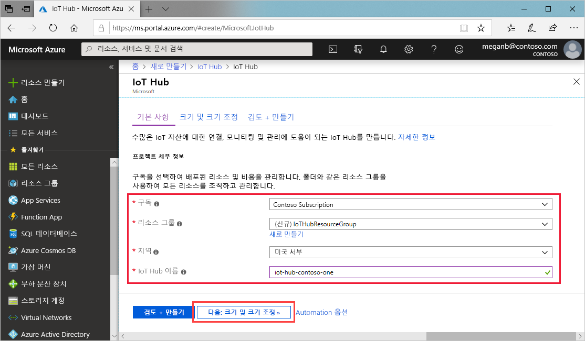
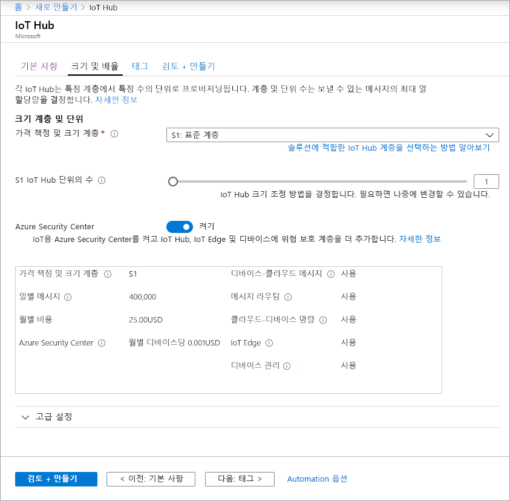

이 섹션에서는 [Azure Portal](https://portal.azure.com)을 사용하여 IoT Hub를 만드는 방법에 대해 설명합니다.

1. [Azure Portal](https://portal.azure.com)에 로그인합니다.

1. **리소스 만들기**를 클릭한 후 **Marketplace 검색** 필드에 *IoT Hub*를 입력합니다.

1. 검색 결과에서 **IoT Hub**, **만들기**를 차례로 선택합니다.

1. **기본** 탭에서 다음과 같이 필드를 완성합니다.

   - **구독**: 허브에 사용할 구독을 선택합니다.

   - **리소스 그룹**: 리소스 그룹을 선택하거나 새로 만듭니다. 새 리소스 그룹을 만들려면 **새로 만들기**를 선택하고 사용하려는 이름을 입력합니다. 기존 리소스 그룹을 사용하려면 해당 기존 리소스 그룹을 선택합니다. 자세한 내용은 [Azure Resource Manager 리소스 그룹 관리](../articles/azure-resource-manager/manage-resource-groups-portal.md)를 참조하세요.

   - **지역**: 허브를 배치할 지역을 선택합니다. 가장 가까운 위치를 선택합니다.

   - **IoT Hub 이름**: 허브 이름을 입력합니다. 이 이름은 전역적으로 고유해야 합니다. 입력한 이름을 사용할 수 있으면 녹색 확인 표시가 나타납니다.

   [!INCLUDE [iot-hub-pii-note-naming-hub](iot-hub-pii-note-naming-hub.md)]

   

1. 완료되면 **다음: 크기 및 규모**를 선택하여 허브를 계속 만듭니다.

   

    이 화면에서 다음 값을 설정할 수 있습니다.

    - **가격 책정 및 크기 조정 계층**: 선택한 계층입니다. 원하는 기능 수와 하루에 솔루션을 통해 보내는 메시지 수에 따라 여러 계층에서 선택할 수 있습니다. 무료 계층은 테스트와 평가를 위해 제공됩니다. 허브에 500개 디바이스를 연결할 수 있으며 하루에 8,000개 메시지까지 허용합니다. 각 Azure 구독은 무료 계층에 하나의 IoT Hub를 만들 수 있습니다.

    - **IoT Hub 단위**: 하루 단위당 허용되는 메시지의 수는 허브의 가격 책정 계층에 따라 다릅니다. 예를 들어 허브가 700,000개의 메시지 수신을 지원하려면 S1 계층 단위 2개를 선택합니다.
    다른 계층 옵션에 대한 자세한 내용은 [적절한 IoT Hub 계층 선택](../articles/iot-hub/iot-hub-scaling.md)을 참조하세요.

    - **고급 설정** > **디바이스-클라우드 파티션**: 이 속성은 디바이스-클라우드 메시지를 메시지의 동시 판독기 수와 연결합니다. 대부분의 허브에는 4개의 파티션만 필요합니다.

1. 이 자습서에서는 기본 옵션을 적용한 다음, **검토 + 만들기**를 선택하여 옵션을 검토합니다. 다음 화면과 비슷하게 표시됩니다.

   

1. **만들기**를 선택하여 새 허브를 만듭니다. 허브를 만드는 데 몇 분이 걸립니다.
