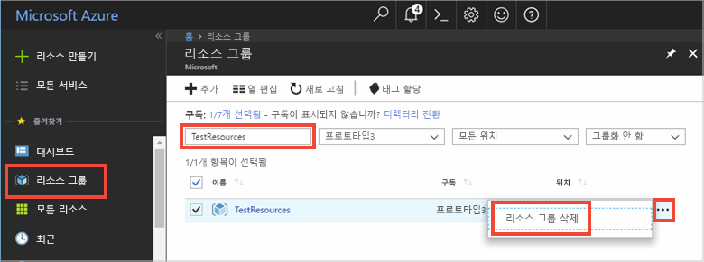

다음 권장 문서를 계속 진행하려는 경우 지금까지 만든 리소스를 그대로 두고 다시 사용할 수 있습니다.

더 이상 진행하지 않을 경우 요금이 발생하지 않도록 이 문서에서 만든 Azure 리소스를 삭제해도 됩니다. 

> [!IMPORTANT]
> 리소스 그룹을 삭제하면 다시 되돌릴 수 없습니다. 리소스 그룹 및 그 안에 포함된 모든 리소스가 영구적으로 삭제됩니다. 잘못된 리소스 그룹 또는 리소스를 자동으로 삭제하지 않도록 해야 합니다. 보관할 리소스가 포함된 기존 리소스 그룹 내에 IoT Hub를 만든 경우 리소스 그룹을 삭제하지 말고 IoT Hub 리소스만 삭제하면 됩니다.
>

리소스 그룹을 이름으로 삭제하려면:

1. [Azure 포털](https://portal.azure.com) 에 로그인하고 **리소스 그룹**을 클릭합니다.

2. **이름을 기준으로 필터링...** 텍스트 상자에 IoT Hub가 들어 있는 리소스 그룹의 이름을 입력합니다. 

3. 결과 목록의 리소스 그룹 오른쪽에서 **...** 를 클릭한 다음, **리소스 그룹 삭제**를 클릭합니다.

    

4. 리소스 그룹을 삭제할지 확인하는 메시지가 표시됩니다. 리소스 그룹의 이름을 다시 입력하여 확인한 다음, **삭제**를 클릭합니다. 잠시 후, 리소스 그룹 및 해당 그룹에 포함된 모든 리소스가 삭제됩니다.