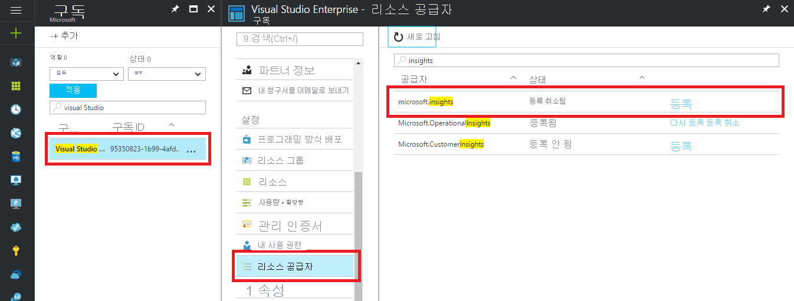

### Azure Diagnostics 문제 해결

다음과 같은 오류 메시지를 받으면 Microsoft.insights 리소스 공급자가 등록되지 않습니다.

`Failed to update diagnostics for 'resource'. {"code":"Forbidden","message":"Please register the subscription 'subscription id' with Microsoft.Insights."}`

리소스 공급자를 등록하려면 Azure Portal에서 다음 단계를 수행합니다.

1.    왼쪽의 탐색 창에서 *구독* 클릭
2.    오류 메시지에서 식별된 구독 선택
3.    *리소스 공급자* 클릭
4.    *Microsoft.insights* 공급자 찾기
5.    *등록* 링크 클릭

*Microsoft.insights* 리소스 공급자가 등록되면 진단 구성을 다시 시도하세요.

PowerShell에서 다음과 같은 오류 메시지가 나타나면 PowerShell의 버전을 업데이트해야 합니다.

`Set-AzureRmDiagnosticSetting : A parameter cannot be found that matches parameter name 'WorkspaceId'.`

PowerShell의 버전을 2016년 11월(v2.3.0)로 업데이트하거나 나중에 [Azure PowerShell cmdlet 시작](https://docs.microsoft.com/powershell/azureps-cmdlets-docs/) 문서의 지침을 사용하여 릴리스합니다.
