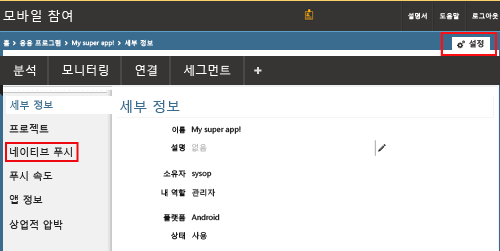
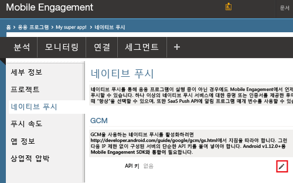
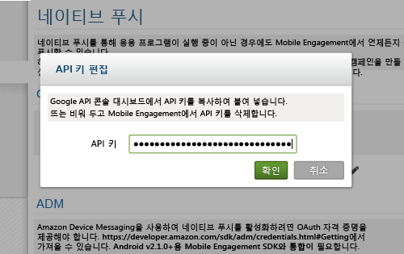
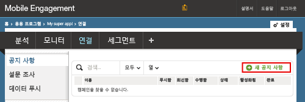
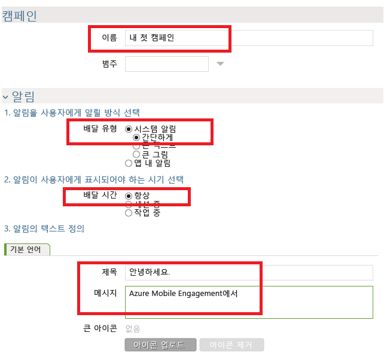
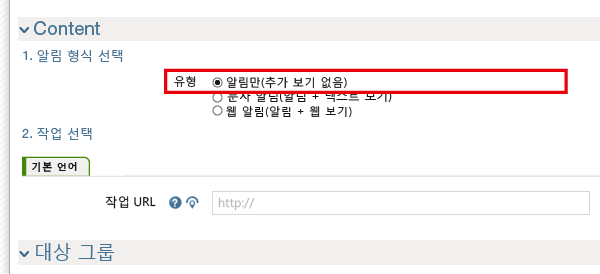
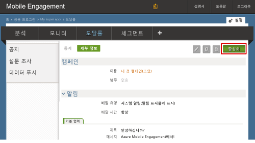

### Mobile Engagement에 GCM API 키에 대한 액세스 권한 부여
사용자를 대신하여 Mobile Engagement에서 푸시 알림을 보내도록 허용하려면 Mobile Engagement에 API 키에 대한 액세스 권한을 부여해야 합니다. 키를 구성하고 Mobile Engagement 포털에 입력하여 이를 수행합니다.

1. Azure 클래식 포털에서 현재 이 프로젝트에 사용하고 있는 앱에 있는지 확인한 다음 아래쪽에서 **연결** 단추를 클릭합니다.
   
    
2. **설정** -> **네이티브 푸시** 섹션을 클릭하여 GCM 키를 입력합니다.
   
    
3. 아래와 같이 **GCM 설정** 섹션의 **API 키** 앞에 있는 **편집** 아이콘을 클릭합니다.
   
    
4. 팝업에서 전에 가져온 GCM 서버 키를 붙여넣은 다음 **확인**을 클릭합니다.
   
    

## 앱에 알림 보내기
이제 앱에 푸시 알림을 보내는 간단한 푸시 알림 캠페인을 만들겠습니다.

1. Mobile Engagement 포털에서 **도달률** 탭으로 이동합니다.
2. **새 공지**를 클릭하여 푸시 알림 캠페인을 만듭니다.
   
    
3. 다음 단계를 수행하여 캠페인의 첫 번째 필드를 설정합니다.
   
    
   
    a. 캠페인 이름을 지정합니다.
   
    b. **Delivery 형식**을 *시스템 알림 -> 심플*로 선택: 이 알림은 제목 및 몇 줄의 텍스트를 특징으로 하는 간단한 Android 푸시 알림 유형입니다.
   
    c. 앱 시작 여부와 관계없이 앱에서 알림을 받을 수 있도록 **배달 시간**을 *항상*으로 선택합니다.
   
    d. 알림 텍스트에서 푸시에 굵게 표시할 **제목**을 입력합니다.
   
    e. 그런 다음 **메시지**를 입력합니다.
4. 아래로 스크롤하여 **콘텐츠** 섹션에서 **알림만**을 선택합니다.
   
    
5. 가능한 가장 기본적인 캠페인 설정을 완료했습니다. 이제 다시 아래로 스크롤하고 **만들기** 단추를 클릭하여 캠페인을 저장합니다.
6. 마지막 단계: **활성화**를 클릭하여 푸시 알림을 보내기 위해 캠페인을 활성화합니다.
   
    

<!---HONumber=AcomDC_0330_2016-->