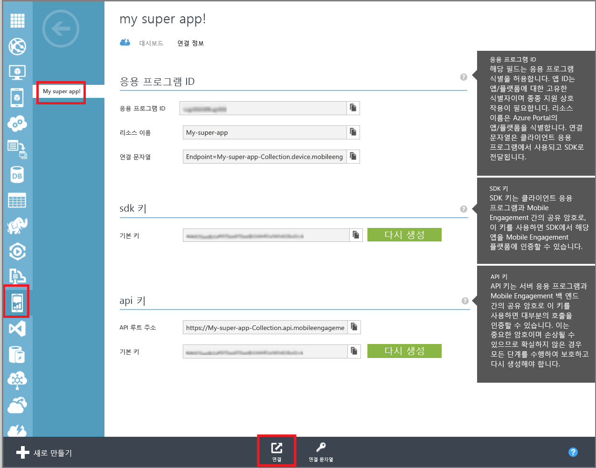
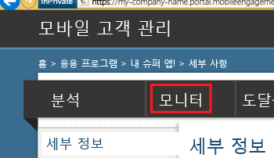

이 섹션에서는 Mobile Engagement의 실시간 모니터링 기능을 사용하여 앱이 Mobile Engagement 백 엔드에 연결되어 있는지 확인하는 방법을 보여 줍니다.

1. Mobile Engagement 포털로 이동합니다. 이 프로젝트에 사용 중인 앱이 열려 있는지 확인하고 맨 아래에서 **연결** 단추를 클릭합니다.

	 

2. Mobile Engagement 포털이 표시됩니다. 여기서 **모니터** 탭을 클릭합니다.
	 
	

3. 모니터는 앱을 시작할 장치를 실시간으로 표시할 준비가 되어 있습니다.
	 
4. 에뮬레이터/시뮬레이터 또는 연결된 장치에서 앱을 시작합니다. 통합이 올바르게 수행되어 이제 앱이 Mobile Engagement 백 엔드에 연결되고 데이터를 보내는 경우 모니터에 하나의 세션이 표시되어야 합니다.
	
	 

<!---HONumber=Oct15_HO3-->