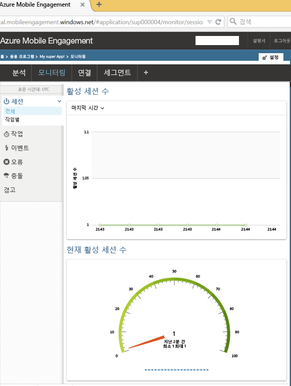

이 섹션에서는 Mobile Engagement의 실시간 모니터링 기능을 사용하여 앱을 Mobile Engagement 백 엔드에 연결하는 방법을 보여줍니다. 

1. **Azure Mobile Engagement** 계정에 있는 **Mobile Engagement** 포털에서 모니터링 및 관리하려는 앱을 선택하도록 합니다. 아래 쪽의 **연결** 단추를 클릭하여 Mobile Engagement 포털로 이동합니다. 
   
     
2. Mobile Engagement 포털이 표시됩니다. 모니터 탭이 선택되지 않은 경우 **모니터**를 클릭합니다.
3. 모니터는 앱을 시작할 장치를 실시간으로 표시할 준비가 되어 있습니다.
4. 이제 앱을 시작합니다. 통합이 올바르게 수행되어 이제 앱이 Mobile Engagement 백 엔드에 연결되고 데이터를 보내는 경우 모니터에 하나의 세션이 표시되어야 합니다.  
   
     

