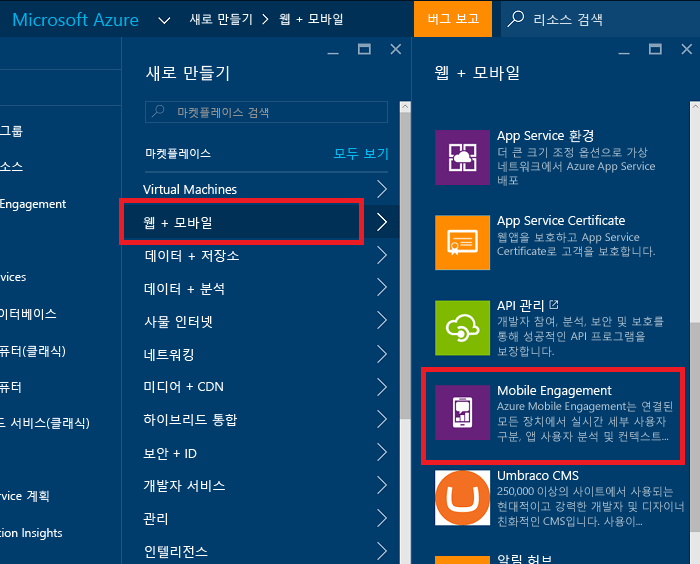
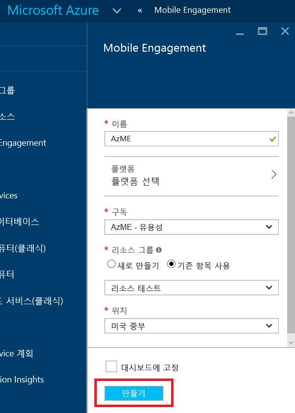
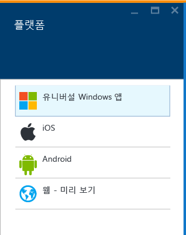
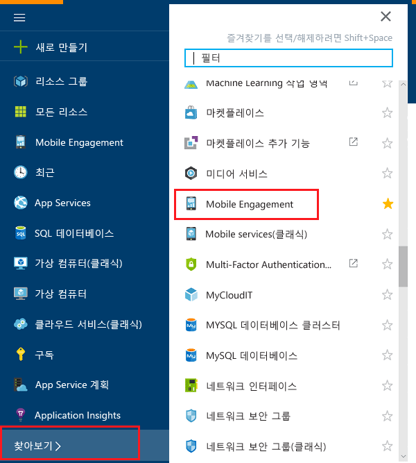
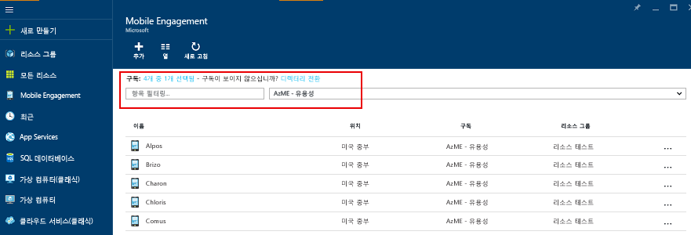
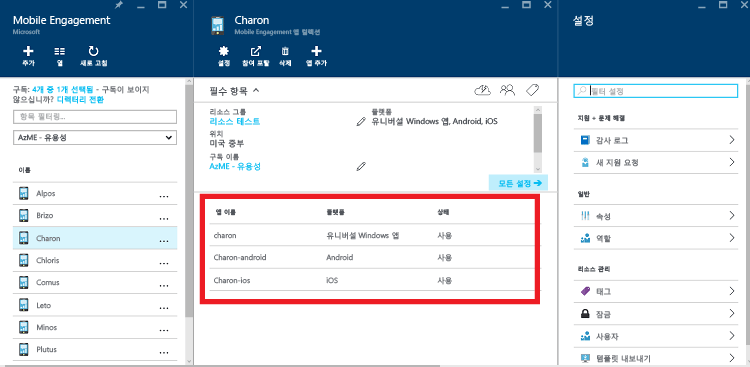
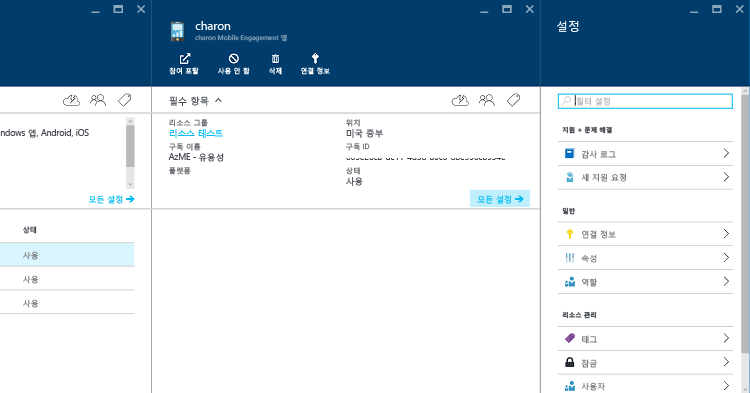

1. [Azure 포털](https://portal.azure.com)에 로그인합니다.
2. **새로 만들기**, **웹 + 모바일**, **Mobile Engagement**를 차례로 클릭합니다.
   
    
3. 표시된 **새 Mobile Engagement 앱 컬렉션** 블레이드에서 Azure 클래식 포털과 같은 앱을 대신하는 앱 컬렉션을 만듭니다. 다음 정보를 입력합니다.
   
    
   
   * **이름**: 이름 of your *응용 프로그램 컬렉션* 
   * **플랫폼**: 열릴 플랫폼 블레이드에서 앱에 대한 대상 플랫폼을 선택합니다. 예: iOS 및 Android에 모두에 대한 앱이 필요하면 두 플랫폼 모두를 선택하고 이 앱 컬렉션에 만든 두 개의 앱을 가져옵니다. 
     
      
   * **구독**: Azure 구독을 선택합니다. 
   * **리소스 그룹**: Azure 리소스(Mobile Engagement 앱 컬렉션)을 배치하려는 Azure 리소스 그룹을 선택합니다. 새 리소스 그룹을 만들 수 있습니다.  
   * **위치**: 앱 컬렉션 및 앱에 대한 데이터를 저장할 지역입니다.
4. **찾아보기**를 클릭하여 Mobile Engagement 앱 컬렉션을 통해 찾아보고 **Mobile Engagement**를 검색합니다.
   
    
5. Mobile Engagement 앱 컬렉션의 목록이 표시됩니다 - 앱 컬렉션을 만든 동일한 Azure 구독이 있어야 합니다.
   
    
6. 이전 단계에서 만든 앱 컬렉션을 클릭하여 앱 컬렉션 내에 있는 다양한 앱을 보여 주는 앱 컬렉션 리소스 블레이드를 엽니다. 
   
    
7. 개발하는 플랫폼에 대해 만든 앱을 클릭합니다. 
   
    
8. 맨 위에 있는 **연결 정보** 명령 단추를 클릭하여 연결 정보 블레이드를 열고 해당 위치에서 연결 문자열을 복사합니다. 
   
    

<!--HONumber=Nov16_HO2-->

