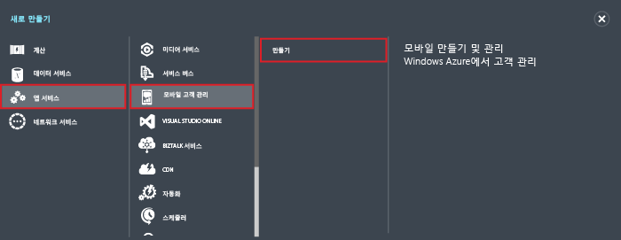
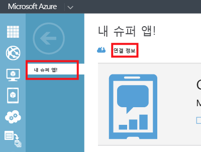

1. Azure 관리 포털에 로그온한 다음 화면 맨 아래에 있는 **+새로 만들기**를 클릭합니다.

2. **앱 서비스**, **Mobile Engagement**, **만들기**를 차례로 클릭합니다.

   	

3. 팝업이 표시되면 다음 정보를 입력합니다.

   	

	- **응용 프로그램 이름**: 응용 프로그램의 이름입니다. 
	- **플랫폼**: 앱의 대상 플랫폼입니다. 모바일 응용 프로그램의 대상으로 지정할 플랫폼당 하나의 Mobile Engagement 앱을 만들어야 합니다. 
	- **응용 프로그램 리소스 이름**: API 및 URL을 통해 이 응용 프로그램에 액세스하는 데 사용되는 이름입니다. 
	- **위치**: 이 앱과 앱 컬렉션을 호스트할 지역/데이터 센터입니다.
	- **컬렉션**: 이전에 만든 컬렉션을 선택하거나 ‘새 컬렉션’을 선택합니다.
	- **컬렉션 이름**: 응용 프로그램 그룹을 나타냅니다. 또한 그룹을 사용하는 경우에는 모든 앱이 그룹에 포함되므로 메트릭의 집계 계산이 가능합니다. 해당하는 경우 여기에 회사 이름이나 부서를 사용해야 합니다.

4. **응용 프로그램** 탭에서 방금 만든 앱을 선택합니다.

5. **연결 정보**를 클릭하여 모바일 앱의 SDK 통합에 적용할 연결 설정을 표시합니다.

   	

6. **연결 문자열** 복사 - 응용 프로그램 코드에서 이 앱을 식별하고 앱에서 Mobile Engagement와 연결하는 데 필요합니다.

   	

<!---HONumber=Sept15_HO4-->