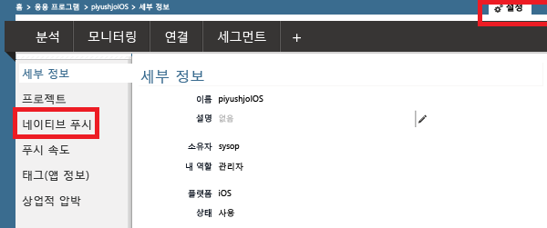
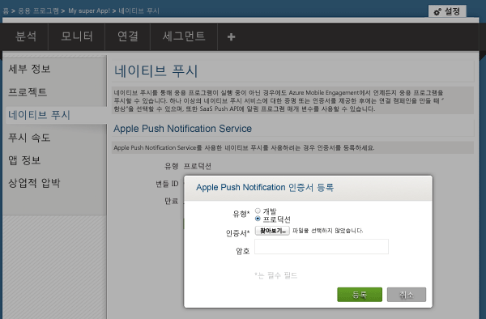
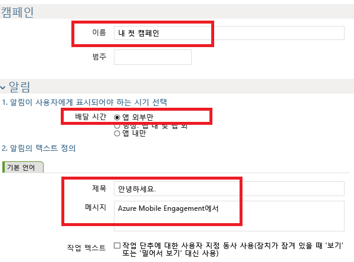
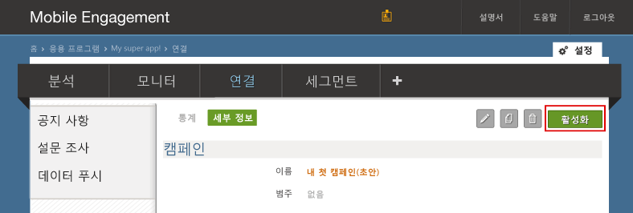
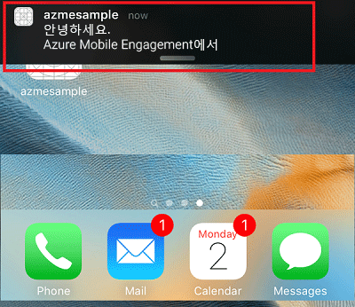
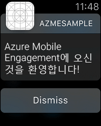

### Mobile Engagement에 푸시 인증서에 대한 액세스 권한 부여
사용자를 대신하여 Mobile Engagement에서 푸시 알림을 보내도록 허용하려면 Mobile Engagement에 인증서에 대한 액세스 권한을 부여해야 합니다. 인증서를 구성하고 Mobile Engagement 포털에 입력하여 이를 수행합니다. [Apple 설명서](https://developer.apple.com/library/prerelease/ios/documentation/IDEs/Conceptual/AppDistributionGuide/AddingCapabilities/AddingCapabilities.html#//apple_ref/doc/uid/TP40012582-CH26-SW6)

1. Mobile Engagement 포털로 이동합니다. 올바른 위치에 있는지 확인하고 맨 아래에서 **연결** 단추를 클릭합니다.
   
    
2. Engagement 포털에서 **설정** 페이지를 클릭합니다. 여기에서 **네이티브 푸시** 섹션을 클릭하여 p12 인증서를 업로드합니다.
   
    
3. 다음과 같이 p12를 선택하여 업로드하고 암호를 입력합니다.
   
    

## 앱에 알림 보내기
이제 앱에 푸시를 보낼 간단한 푸시 알림 캠페인을 만듭니다.

1. Mobile Engagement 포털에서 **도달률** 탭으로 이동합니다.
2. **새 알림** 을 클릭하여 푸시 캠페인을 만듭니다.
   
    
3. 다음과 같이 캠페인의 첫 번째 필드를 설정합니다.
   
    
   
   * 캠페인 **이름** 을 입력합니다. 
   * **배달 시간**을 **Out of app only(앱 외부에서만)** 로 선택합니다. 이는 일부 텍스트를 제공하는 간단한 Apple 푸시 알림 유형입니다.
   * 알림 텍스트에서 먼저 푸시의 첫 줄에 표시될 **제목** 을 입력합니다.
   * 그런 다음 두 번째 줄에 표시될 **메시지** 를 입력합니다.
4. 아래로 스크롤하여 콘텐츠 섹션에서 **알림만**
   
    
5. 가장 기본적인 캠페인 설정을 완료했습니다. 이제 아래로 스크롤하고 **만들기** 단추를 클릭하여 푸시 알림 캠페인을 저장합니다. 
6. 끝으로 **활성화** 를 클릭하여 푸시 알림을 보냅니다. 
   
    
7. 다음과 같이 알림 센터에서 iOS 장치에 대한 알림을 받게 됩니다.
   
    
8. 이 iOS 장치와 페어링된 Apple Watch가 있으면 해당 Apple Watch에 알림이 표시됩니다.
   
    

