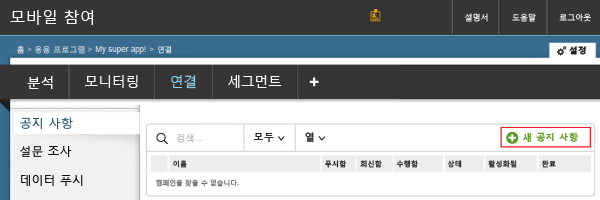
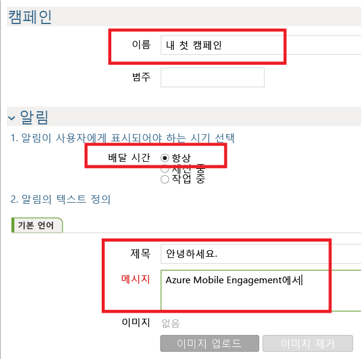
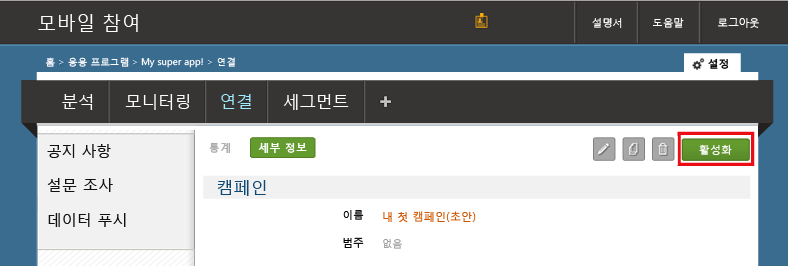

이제 앱에 푸시 알림을 보내는 간단한 푸시 알림 캠페인을 만들겠습니다.

1. Mobile Engagement 포털에서 **도달률** 탭으로 이동합니다.
2. **새 공지** 를 클릭하여 푸시 알림 캠페인을 만듭니다.
   
    
3. 다음 단계를 수행하여 캠페인의 첫 번째 필드를 설정합니다.
   
    
   
    a. 캠페인에 **이름** 을 제공합니다.
   
    b. **배달 시간** 을 *언제든지*로 선택합니다.
   
    d. 알림 텍스트에서 푸시에 굵게 표시할 **제목** 을 입력합니다.
   
    e. 그런 다음 **메시지**
4. 아래로 스크롤하여 **콘텐츠** 섹션에서 **알림만**을 선택합니다.
   
    
5. 가능한 가장 기본적인 캠페인 설정을 완료했습니다. 이제 다시 아래로 스크롤하고 **만들기** 단추를 클릭하여 캠페인을 저장합니다.
6. 마지막 단계: **활성화** 를 클릭하여 캠페인을 활성화하고 푸시 알림을 보냅니다.
   
    

<!--HONumber=Nov16_HO2-->

