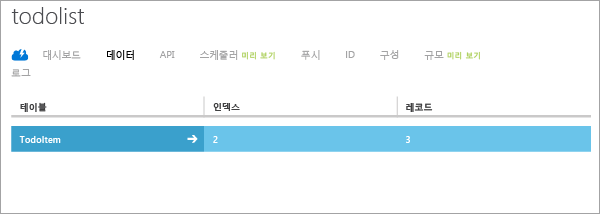

이 자습서의 최종 단계는 새 앱을 빌드하고 실행하는 것입니다.

1. 압축된 프로젝트 파일을 저장한 위치로 이동한 후 컴퓨터에서 Android Studio 프로젝트 디렉터리에 파일 압축을 풉니다.

2. Android Studio를 엽니다. 프로젝트로 작업 중인 경우 해당 프로젝트가 나타나면 프로젝트를 닫습니다(File => Close Project).

3. **기존 Android Studio 프로젝트 열기**를 선택하고 프로젝트 위치를 찾은 후 **확인**을 클릭합니다.

 	

4. 왼쪽 **프로젝트 탐색기** 창에서 *프로젝트* 탭이 선택되어 있는지 확인하고 **app**, **src**, **java**를 연 후 **ToDoactivity**를 두 번 클릭합니다.

   	

5. 2\.0 버전의 SDK를 다운로드한 경우 코드를 모바일 서비스의 URL 및 키로 업데이트해야 합니다.
	- 	**TodoActivity.java**에서 **OnCreate** 메서드를 찾아 모바일 서비스 클라이언트를 인스턴스화하는 코드를 찾습니다. 이 코드는 이전 이미지에서 확인할 수 있습니다.
	- 	"MobileServiceUrl"을 모바일 서비스의 실제 URL로 바꿉니다.
	- 	"AppKey"를 모바일 서비스의 키로 바꿉니다.
	- 	자세한 내용은 [기존 앱에 모바일 서비스 추가](../articles/mobile-services/mobile-services-android-get-started-data.md) 자습서를 참조하세요. 

6. **Run** 메뉴에서 **Run**을 클릭하여 Android 에뮬레이터에서 프로젝트를 시작합니다.

	> [AZURE.IMPORTANT]Android 에뮬레이터에서 프로젝트를 실행할 수 있으려면 AVD(Android Virtual Device)를 하나 이상 정의해야 합니다. AVD Manager를 사용하여 이러한 장치를 만들고 관리합니다.

7. 앱에서 _Complete the tutorial_ 등의 의미 있는 텍스트를 입력하고 **Add**를 클릭합니다.

   	![][10]

   	Azure에 호스트된 새 모바일 서비스에 POST 요청이 전송됩니다. 요청에서 데이터가 TodoItem 테이블에 삽입됩니다. TodoItem 테이블에 저장된 항목이 모바일 서비스에서 반환된 후 데이터가 목록에 표시됩니다.

	> [AZURE.NOTE]모바일 서비스에 액세스하여 데이터를 쿼리 및 삽입하는 코드를 검토할 수 있습니다. 이 코드는 ToDoActivity.java 파일에 있습니다.

8. 관리 포털로 돌아가서 **데이터** 탭을 클릭한 후 **TodoItems** 테이블을 클릭합니다.

   	

   	이를 통해 앱에서 테이블로 삽입된 데이터를 찾을 수 있습니다.

   	

<!-- Images. -->
[0]: ./media/mobile-services-android-get-started/mobile-quickstart-completed-android.png
[6]: ./media/mobile-services-android-get-started/mobile-portal-quickstart-android.png
[7]: ./media/mobile-services-android-get-started/mobile-quickstart-steps-android.png
[8]: ./media/mobile-services-android-get-started/Android-Studio-quickstart.png
[10]: ./media/mobile-services-android-get-started/mobile-quickstart-startup-android.png
[11]: ./media/mobile-services-android-get-started/mobile-data-tab.png
[12]: ./media/mobile-services-android-get-started/mobile-data-browse.png
[14]: ./media/mobile-services-android-get-started/android-studio-import-project.png
[15]: ./media/mobile-services-android-get-started/mobile-services-import-android-project.png

<!-- URLs. -->
[Add Mobile Services to an existing app]: ../articles/mobile-services/mobile-services-android-get-started-data.md
[Get started with authentication]: ../articles/mobile-services/mobile-services-android-get-started-users.md
[Get started with push notifications]: ../articles/mobile-services/mobile-services-javascript-backend-android-get-started-push.md
[Android SDK]: https://go.microsoft.com/fwLink/p/?LinkID=280125
[Android Studio]: https://developer.android.com/sdk/index.html
[Mobile Services Android SDK]: https://go.microsoft.com/fwLink/p/?LinkID=266533

[Management Portal]: https://manage.windowsazure.com/

<!---HONumber=August15_HO6-->