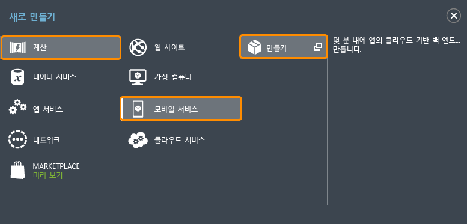
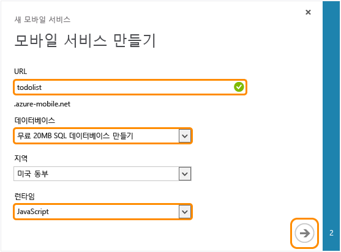

다음 단계에 따라 새 모바일 서비스를 만드십시오.

1. [Azure 클래식 포털](https://manage.windowsazure.com/)에 로그인합니다. 탐색 창 맨 아래쪽에서 **+새로 만들기**를 클릭합니다. **계산**, **모바일 서비스**를 확장한 후 **만들기**를 클릭합니다.
   
   
   
   **모바일 서비스 만들기** 대화 상자가 표시됩니다.
2. **모바일 서비스 만들기** 대화 상자에서 **무료 20MB SQL 데이터베이스 만들기**, **JavaScript** 런타임을 차례로 선택한 후 **URL** 입력란에 새 모바일 서비스를 위한 하위 도메인 이름을 입력합니다. 오른쪽 화살표 단추를 클릭하여 다음 페이지로 이동합니다.
   
   
   
   **데이터베이스 설정 지정** 페이지가 표시됩니다.
   
   > [!NOTE]
   > 이 자습서에는 새 SQL 데이터베이스 인스턴스와 서버를 만드는 과정이 포함되어 있으며, 이 새 데이터베이스는 다른 SQL 데이터베이스 인스턴스처럼 다시 사용하고 관리할 수 있습니다. 새 모바일 서비스로 같은 지역에 데이터베이스를 이미 가지고 있다면 대신 **기존 데이터베이스 사용**을 선택할 수 있습니다. 다른 지역에 있는 데이터베이스는 추가 대역폭 비용과 대기 시간이 높으므로 사용을 권장하지 않습니다.
   > 
   > 
3. **이름**에 새 데이터베이스 이름을 입력한 후 **로그인 이름**에 새 SQL 데이터베이스 서버의 관리자 로그인 이름을 입력하고, 암호를 입력한 후 확인하고, 확인 단추를 클릭하여 완료합니다.
   
   

이제 모바일 앱에 사용할 수 있는 새 모바일 서비스를 만들었습니다.

<!---HONumber=AcomDC_1203_2015-->
