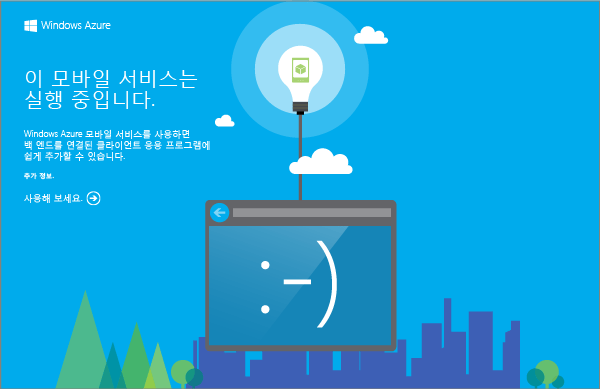

다운로드하는 모바일 서비스 프로젝트를 통해 로컬 컴퓨터 또는 가상 컴퓨터에서 새 모바일 서비스를 실행할 수 있습니다. 이렇게 하면 Azure에 게시하기 전이더라도 서비스 코드를 쉽게 디버그할 수 있습니다.

이 섹션에서는 로컬로 실행 중인 모바일 서비스에 대해 새 앱을 테스트합니다.

1. 압축된 프로젝트 파일을 저장한 위치로 이동한 후 컴퓨터에서 파일 압축을 풀고 Visual Studio에서 솔루션 파일을 엽니다.
2. Visual Studio의 솔루션 탐색기에서 서비스 프로젝트를 마우스 오른쪽 단추로 클릭하고 **시작 프로젝트로 설정**을 클릭한 다음 **F5** 키를 눌러 해당 프로젝트를 빌드하고 로컬로 모바일 서비스를 시작합니다.
   
    
   
    모바일 서비스가 성공적으로 시작된 후에 웹 페이지가 표시됩니다.
3. 스토어 앱을 테스트하려면 클라이언트 앱 프로젝트를 마우스 오른쪽 단추로 클릭하고 **시작 프로젝트로 설정**을 클릭한 다음 **F5** 키를 눌러 해당 프로젝트를 다시 빌드하고 앱을 시작합니다.
   
    이렇게 하면 앱이 시작되어 로컬 모바일 서비스 인스턴스에 연결됩니다.
4. 앱에서 _Insert a TodoItem_에서 **Complete the tutorial** 등의 의미 있는 텍스트를 입력하고 **Save**를 클릭합니다.
   
    이렇게 하면 POST 요청이 로컬 모바일 서비스에 전송됩니다. 요청에서 데이터가 TodoItem 테이블에 삽입됩니다. 테이블에 저장된 항목이 모바일 서비스에서 반환되고 그 데이터가 앱의 두 번째 열에 표시됩니다.

<!---HONumber=Oct15_HO3-->