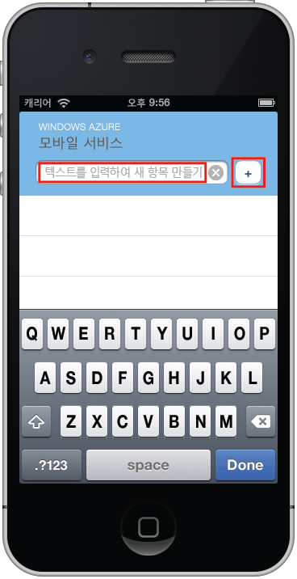



이 자습서의 최종 단계는 새 앱을 빌드하고 실행하는 것입니다.

1. 압축된 프로젝트 파일을 저장한 위치로 이동한 후 컴퓨터에서 파일 압축을 풀고 Xcode를 사용하여 프로젝트 파일을 엽니다.

   	

2. **실행** 단추를 눌러 프로젝트를 빌드하고 이 프로젝트의 기본값인 iPhone 에뮬레이터에서 앱을 시작합니다.

3. 앱에서 _Complete the tutorial_ 등의 의미 있는 텍스트를 입력한 후 더하기(**+**) 아이콘을 클릭합니다.

   	

   	Azure에 호스트된 새 모바일 서비스에 POST 요청이 전송됩니다. 요청에서 데이터가 TodoItem 테이블에 삽입됩니다. TodoItem 테이블에 저장된 항목이 모바일 서비스에서 반환된 후 데이터가 목록에 표시됩니다.

	>[AZURE.NOTE]모바일 서비스에 액세스하는 코드를 검토하여 데이터를 쿼리 및 삽입할 수 있습니다(TodoService.m 파일에 있음).
 
 	

<!--HONumber=42-->
