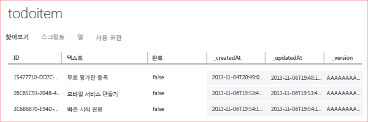

이 자습서의 최종 단계는 새 앱을 빌드하고 실행하는 것입니다.

1. 압축된 프로젝트 파일을 저장한 위치로 이동한 후 컴퓨터에서 파일 압축을 풀고 Visual Studio에서 솔루션 파일을 엽니다.

2. **F5** 키를 눌러 프로젝트를 다시 빌드하고 앱을 시작합니다.

3. 앱에서 *Insert a TodoItem*에서 **Complete the tutorial** 등의 의미 있는 텍스트를 입력하고 **Save**를 클릭합니다.

   	Azure에 호스트된 새 모바일 서비스에 POST 요청이 전송됩니다. 요청에서 데이터가 TodoItem 테이블에 삽입됩니다. 테이블에 저장된 항목이 모바일 서비스에서 반환되고 그 데이터가 앱의 두 번째 열에 표시됩니다.

4. (선택 사항) 범용 Windows 솔루션에서 기본 시작 프로젝트를 다른 앱으로 변경하고 앱을 다시 실행합니다.

	앱이 시작된 후 이전 단계에서 저장한 데이터가 모바일 서비스에서 로드됩니다.
 
4. 관리 포털로 돌아가서 **데이터** 탭을 클릭한 후 **TodoItems** 테이블을 클릭합니다.

   	이를 통해 앱에서 테이블로 삽입된 데이터를 찾을 수 있습니다.

   	

<!---HONumber=62-->