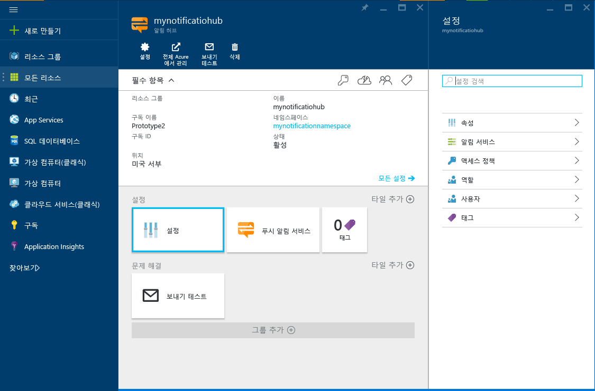

1. [Azure 포털](https://portal.azure.com)에 로그온한 다음 화면 왼쪽 위에서 **+새로 만들기**를 클릭합니다.

2. **새로 만들기**, **웹 + 모바일**을 차례로 클릭합니다. 필요한 경우 아래로 스크롤하여 **알림 허브**를 클릭합니다.

   	

3. **알림 허브** 필드에 고유한 이름을 지정해야 합니다. 원하는 **하위 지역**, **구독** 및 **리소스 그룹**(이미 있는 경우)을 선택합니다.
 
	안에 허브에서 만들려는 서비스 버스 네임스페이스가 이미 있는 경우 **네임스페이스** 필드의 **기존 선택** 옵션을 통해 선택합니다. 그렇지 않고 네임스페이스 이름을 사용할 수 있는 경우 허브 이름을 기준으로 생성될 기본 이름을 사용할 수 있습니다.

	준비되면 **만들기**를 클릭합니다.

   	

4. 네임스페이스와 알림 허브가 만들어지면 해당 포털 페이지로 이동합니다.

   	
       
5. **설정**, **액세스 정책**을 차례로 클릭합니다. 사용자에게 제공되는 두 연결 문자열을 기록해 둡니다. 나중에 푸시 알림을 처리하는 데 필요합니다.

   	

<!---HONumber=AcomDC_0413_2016-->