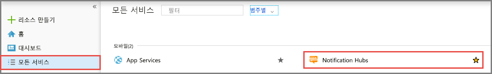
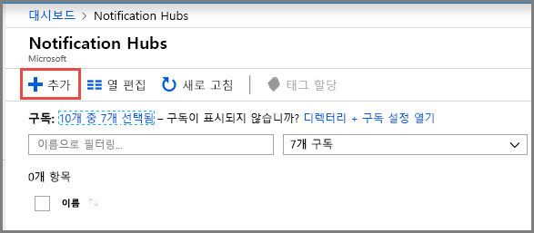
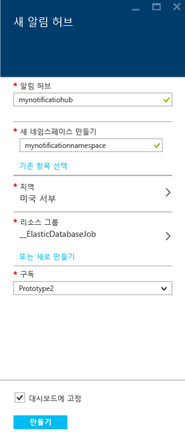
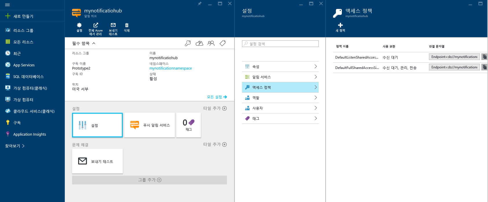

1. [Azure Portal](https://portal.azure.com)에 로그인합니다.

1. 왼쪽 메뉴에서 **모든 서비스**를 선택하고, **모바일** 섹션에서 **Notification Hubs**를 선택합니다. 서비스 이름 옆의 별표 아이콘을 선택하여 서비스를 왼쪽 메뉴의 **즐겨찾기** 섹션에 추가합니다. **Notification Hubs**를 **즐겨찾기**에 추가한 후 왼쪽 메뉴에서 선택합니다.

      

1. **Notification Hubs** 페이지의 도구 모음에서 **추가**를 선택합니다.

      

1. **Notification Hub** 페이지에서 다음 단계를 수행합니다.

    1. **알림 허브**에 이름을 입력합니다.  

    1. **새 네임스페이스 만들기**에 이름을 입력합니다. 네임스페이스에는 하나 이상의 허브가 포함되어 있습니다.

    1. **위치** 드롭다운 목록 상자에서 값을 선택합니다. 이 값은 알림 허브를 만들려는 위치를 지정합니다.

    1. **리소스 그룹**에서 기존 리소스 그룹을 선택하거나 새 리소스 그룹의 이름을 만듭니다.

    1. **만들기**를 선택합니다.

        

1. **알림**(벨 아이콘)을 선택하고, **리소스로 이동**을 선택합니다. **Notification Hubs** 페이지의 목록을 새로 고치고 알림 허브를 선택할 수도 있습니다.

      ![[Azure Portal] - [알림] -> [리소스로 이동]](./media/notification-hubs-portal-create-new-hub/go-to-notification-hub.png)

1. 목록에서 **액세스 정책**을 선택합니다. 사용할 수 있는 두 가지 연결 문자열을 적어 둡니다. 나중에 푸시 알림을 처리하는 데 필요합니다.

      >[!IMPORTANT]
      >애플리케이션에서 **DefaultFullSharedAccessSignature** 정책을 *사용하지 마세요*. 이는 백 엔드에서만 사용할 수 있습니다.
      >

      
