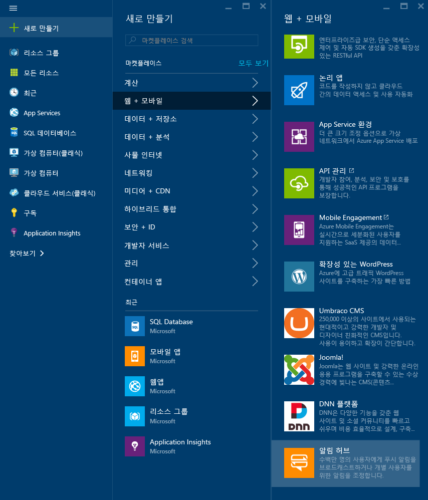

1. [Azure Portal](https://portal.azure.com)에 로그인합니다.

2. **리소스 만들기** > **모바일** > **알림 허브**를 선택합니다.
   
      
      
3. **알림 허브** 상자에 고유한 이름을 입력합니다. **지역**, **구독** 및 **리소스 그룹**(이미 있는 경우)을 선택합니다. 
   
      서비스 버스 네임스페이스가 아직 없는 경우 허브 이름에 따라 생성되는 기본 이름을 사용할 수 있습니다(네임스페이스 이름을 사용할 수 있는 경우).
    
      허브를 만들려는 서비스 버스 네임스페이스가 이미 있는 경우 다음 단계를 수행합니다.

    a. **네임스페이스** 영역에서 **기존 선택** 링크를 선택합니다. 
   
    나. **만들기**를 선택합니다.
   
      

4. **알림**(벨 아이콘)을 선택하고 **리소스로 이동**을 선택합니다. 

      ![[Azure Portal] - [알림] -> [리소스로 이동]](./media/notification-hubs-portal-create-new-hub/notification-go-to-resource.png)    
5. 목록에서 **액세스 정책**을 선택합니다. 사용할 수 있는 두 가지 연결 문자열을 적어 둡니다. 나중에 푸시 알림을 처리하는 데 필요합니다.

      >[!IMPORTANT]
      >응용 프로그램에서 DefaultFullSharedAccessSignature를 **사용하지 마세요**. 이는 백 엔드에서만 사용할 수 있습니다.
      >
   
      

