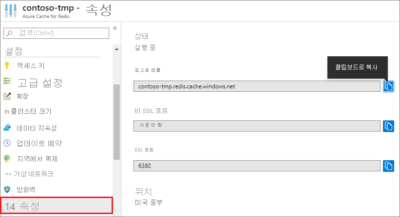

### Azure Portal을 사용하여 호스트 이름, 포트 및 액세스 키를 검색합니다.

Azure Cache for Redis 인스턴스에 연결할 때 캐시 클라이언트에 캐시의 호스트 이름, 포트 및 키가 필요합니다. 일부 클라이언트는 약간 다른 이름으로 이러한 항목을 참조할 수 있습니다. 이 정보는 Azure Portal에서 검색할 수 있습니다.

#### 액세스 키 및 호스트 이름을 검색하려면

1. [Azure Portal](https://portal.azure.com)을 사용하여 액세스 키를 검색하려면 캐시를 찾아서 **액세스 키**를 선택합니다. 

    

2. 호스트 이름 및 포트를 검색하려면 **속성**을 선택합니다.

    

