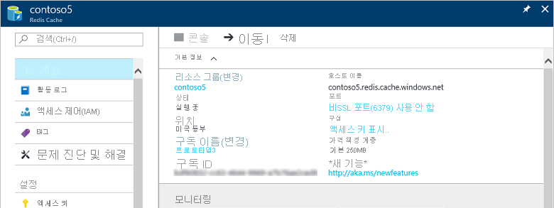

캐시를 대시보드에 고정하지 않은 경우 **모든 서비스**를 사용하여 [Azure Portal](https://portal.azure.com)에서 캐시를 찾습니다.

캐시를 보려면 **모든 서비스**를 클릭하고 **Azure Cache for Redis**를 검색합니다. 

원하는 캐시를 선택하여 해당 캐시의 설정을 보고 구성합니다.

**Azure Cache for Redis** 블레이드에서 캐시를 보고 구성할 수 있습니다.

