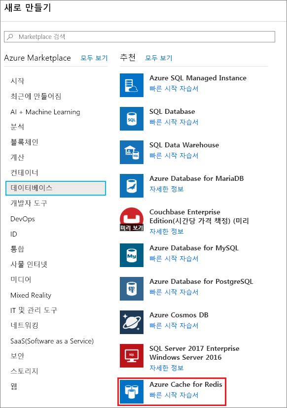
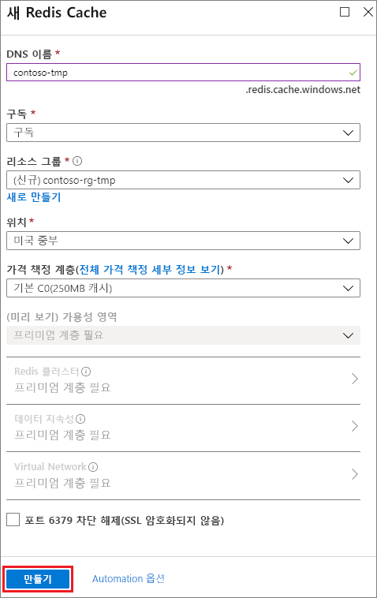
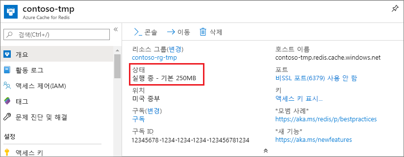

1. 캐시를 만들려면 먼저 [Azure Portal](https://portal.azure.com)에 로그인합니다. 그런 다음, **리소스 만들기** > **데이터베이스** > **Azure Cache for Redis**를 선택합니다.

    

2. **새 Azure Cache for Redis**에서 새 캐시의 설정을 구성합니다.

    | 설정      | 제안 값  | 설명 |
    | ------------ |  ------- | -------------------------------------------------- |
    | **DNS 이름** | 전역적으로 고유한 이름 | 캐시 이름은 1~63자의 문자열로, 숫자, 영문자 및 `-` 문자만 포함할 수 있습니다. 캐시 이름은 `-` 문자로 시작하거나 끝날 수 없고 연속되는 `-` 문자는 유효하지 않습니다.  | 
    | **구독** | 사용자의 구독 | 이 새로운 Azure Cache for Redis 인스턴스가 만들어지는 구독입니다. | 
    | **리소스 그룹** |  *TestResources* | 캐시를 만들 새 리소스 그룹의 이름입니다. 앱의 모든 리소스를 한 그룹에 배치하여 다 함께 관리할 수 있습니다. 예를 들어 리소스 그룹을 삭제하면 앱과 연결된 모든 리소스가 삭제됩니다. | 
    | **위치**: | 미국 동부 | 캐시를 사용할 다른 서비스와 가까이 있는 [영역](https://azure.microsoft.com/regions/)을 선택합니다. |
    | **[가격 책정 계층](https://azure.microsoft.com/pricing/details/cache/)** |  기본 C0(250MB 캐시) |  가격 책정 계층은 캐시에 사용 가능한 크기, 성능 및 기능을 결정합니다. 자세한 내용은 [Azure Cache for Redis 개요](../articles/azure-cache-for-redis/cache-overview.md)를 참조하세요. |
    | **대시보드에 고정** |  선택 | 새 캐시를 대시보드에 고정하면 새 캐시를 쉽게 찾을 수 있습니다. |

     

3. 새 캐시 설정을 구성한 후에 **만들기**를 선택합니다. 

    캐시를 만드는 데 몇 분 정도 걸릴 수 있습니다. 상태를 확인하려면 대시 보드에서 진행률을 모니터링하면 됩니다. 캐시가 생성되면 새 캐시는 **실행 중** 상태를 표시하고 즉시 사용할 수 있습니다.

    

