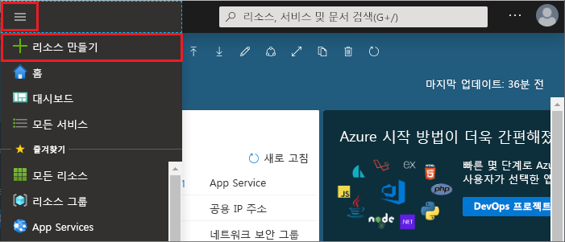

1. 캐시를 만들려면 [Azure Portal](https://portal.azure.com)에 로그인하여 **리소스 만들기**를 선택합니다. 
   
   
   
1. **새로 만들기** 페이지에서 **데이터베이스**를 선택한 다음, **Azure Cache for Redis**를 선택합니다.
   
   
   
1. **새 Redis Cache** 페이지에서 새 캐시의 설정을 구성합니다.
   
   | 설정      | 제안 값  | 설명 |
   | ------------ |  ------- | -------------------------------------------------- |
   | **DNS 이름** | 전역적으로 고유한 이름을 입력합니다. | 캐시 이름은 1~63자의 문자열이어야 하며 숫자, 문자 및 하이픈만 포함할 수 있습니다. 이름은 숫자 또는 문자로 시작하고 끝나야 하며 연속 하이픈을 포함할 수 없습니다. 캐시 인스턴스의 *호스트 이름*은 *\<DNS 이름>.redis.cache.windows.net*입니다. | 
   | **구독** | 드롭다운하여 구독을 선택합니다. | 이 구독 아래에 새 Azure Cache for Redis 인스턴스가 만들어집니다. | 
   | **리소스 그룹** | 드롭다운하여 리소스 그룹을 선택하거나, **새로 만들기**를 선택하고 새 리소스 그룹 이름을 입력합니다. | 캐시 및 기타 리소스를 만들 새 리소스 그룹의 이름입니다. 모든 앱 리소스를 하나의 리소스 그룹에 배치하면 앱 리소스를 쉽게 관리하거나 삭제할 수 있습니다. | 
   | **위치** | 드롭다운하여 위치를 선택합니다. | 캐시를 사용할 다른 서비스와 가까이 있는 [Azure 지역](https://azure.microsoft.com/regions/)을 선택합니다. |
   | **가격 책정 계층** | 드롭다운하여 [가격 책정 계층](https://azure.microsoft.com/pricing/details/cache/)을 선택합니다. |  가격 책정 계층은 캐시에 사용 가능한 크기, 성능 및 기능을 결정합니다. 자세한 내용은 [Azure Cache for Redis 개요](../articles/azure-cache-for-redis/cache-overview.md)를 참조하세요. |
   
1. **만들기**를 선택합니다. 
   
    
   
   캐시를 만드는 데 잠시 시간이 걸립니다. Azure Cache for Redis **개요** 페이지에서 진행률을 모니터링할 수 있습니다. **상태**가 **실행 중**으로 표시되면 캐시를 사용할 준비가 된 것입니다.
   
   

