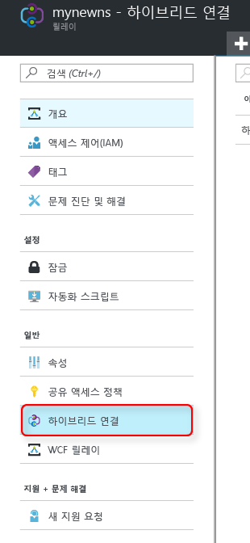
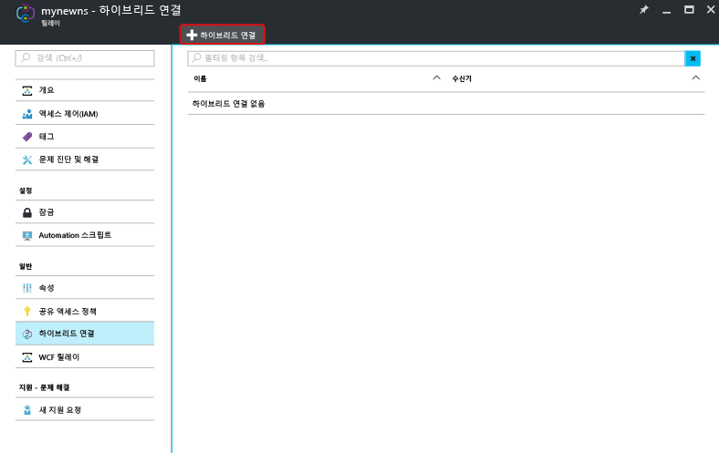
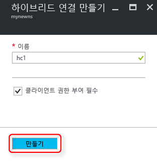

[Relay 네임스페이스][namespace-how-to]를 이미 만들었는지 확인합니다.

1. [Azure Portal](https://portal.azure.com)에 로그인합니다.
2. 왼쪽 메뉴에서 **모든 리소스**를 선택합니다.
3. 하이브리드 연결을 만들려는 네임스페이스를 선택합니다. 이 경우 **mynewns**입니다.  
4. **Relay 네임스페이스** 아래에서 **하이브리드 연결**을 선택합니다.

    

5. 네임스페이스 개요 창에서 **+ 하이브리드 연결**을 선택합니다.
   
    
6. **하이브리드 연결 만들기** 아래에서 하이브리드 연결 이름에 대한 값을 입력합니다. 다른 기본값은 그대로 둡니다.
   
    
7. **만들기**를 선택합니다.

[namespace-how-to]: ../articles/service-bus-relay/relay-create-namespace-portal.md 