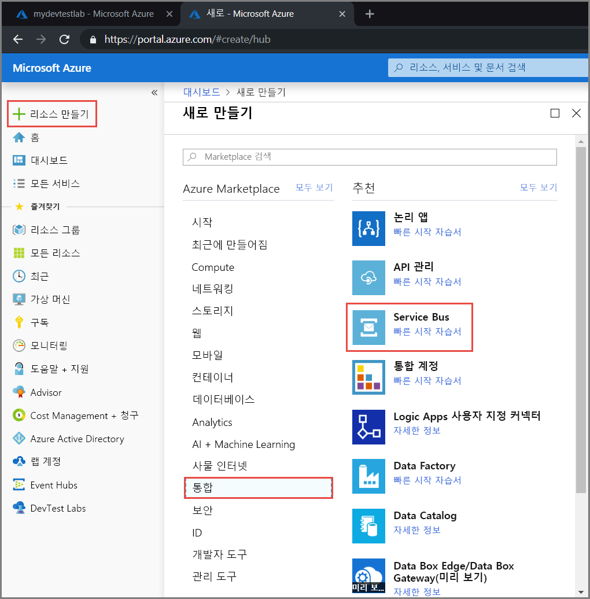
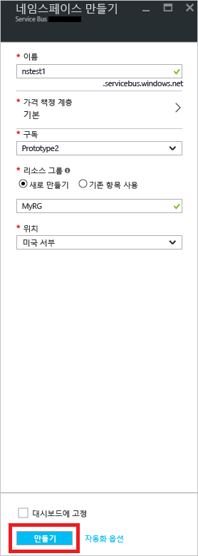
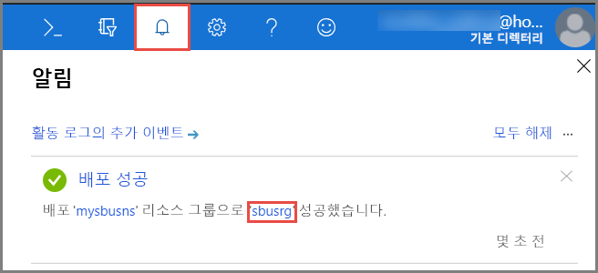
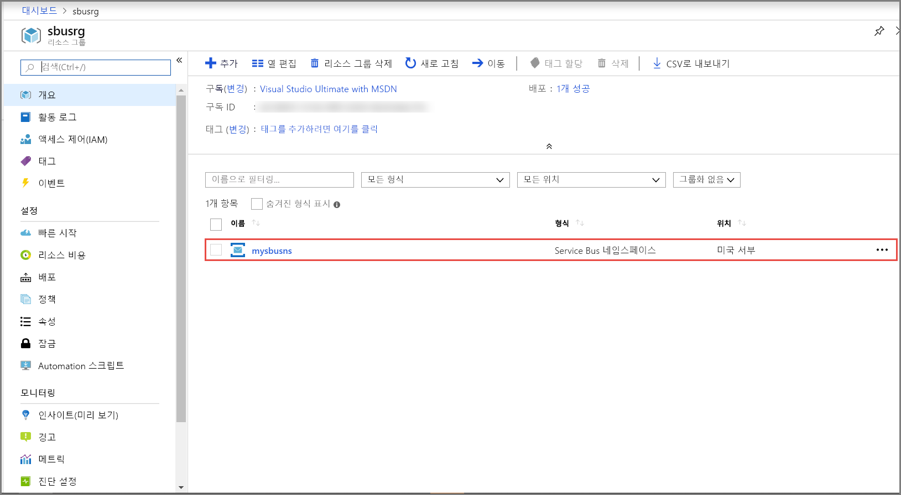
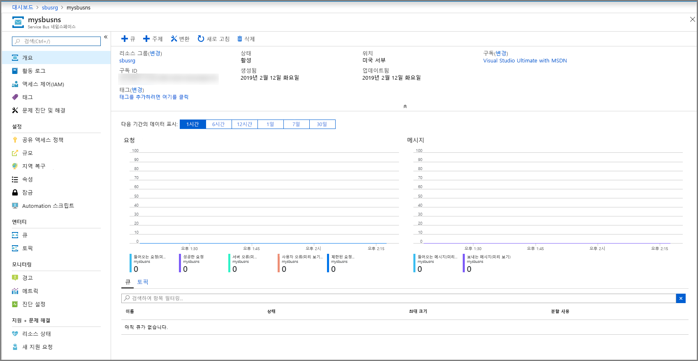
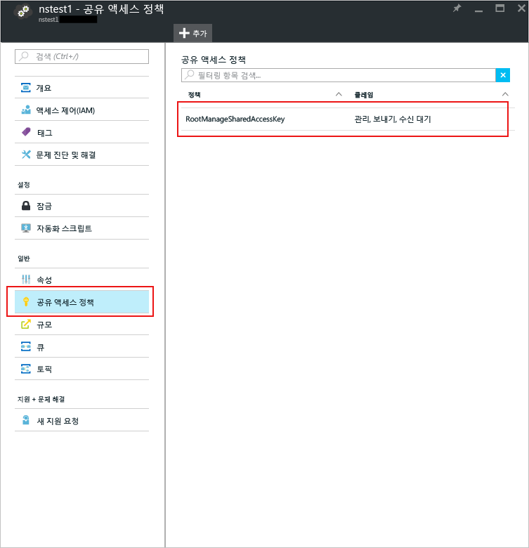
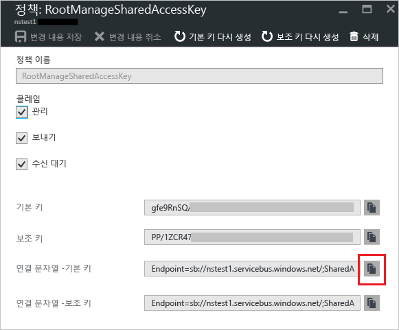

## Azure Portal에서 네임스페이스 만들기
Azure에서 Service Bus 메시징 엔터티 사용을 시작하려면 먼저 Azure에서 고유한 이름인 네임스페이스를 만들어야 합니다. 네임스페이스는 애플리케이션 내에서 Service Bus 리소스의 주소를 지정하기 위한 범위 컨테이너를 제공합니다.

네임스페이스를 만들려면

1.  [Azure 포털](https://portal.azure.com)
2. 포털의 왼쪽 탐색 창에서 **+ 리소스 만들기**, **통합**, **Service Bus**를 차례로 선택합니다.

    
3. **네임스페이스 만들기** 대화 상자에서 다음 단계를 수행합니다. 
    1. **네임스페이스 이름**을 입력합니다. 시스템에서 사용 가능한 이름인지 즉시 확인합니다. 네임스페이스 명명 규칙 목록은 [네임스페이스 REST API 만들기](/rest/api/servicebus/create-namespace)를 참조하세요.
    2. 네임스페이스에 대한 가격 책정 계층(기본, 표준 또는 프리미엄)을 선택합니다. [토픽 및 구독](../articles/service-bus-messaging/service-bus-queues-topics-subscriptions.md#topics-and-subscriptions)을 사용하려면 표준 또는 프리미엄을 선택합니다. 토픽/구독은 기본 가격 책정 계층에서 지원되지 않습니다.
    3. **프리미엄** 가격 책정 계층을 선택한 경우 다음 단계를 따릅니다. 
        1. **메시징 단위**의 수를 지정합니다. 프리미엄 계층은 CPU 및 메모리 수준에서 리소스 격리를 제공하므로 각 워크로드가 독립적으로 실행됩니다. 이 리소스 컨테이너를 메시징 단위라고 합니다. 프리미엄 네임스페이스에는 하나 이상의 메시징 단위가 있습니다. 각 Service Bus 프리미엄 네임스페이스에 대해 1, 2 또는 4의 메시징 단위를 선택할 수 있습니다. 자세한 내용은 [Service Bus 프리미엄 메시징](../articles/service-bus-messaging/service-bus-premium-messaging.md)을 참조하세요.
        2. 네임스페이스 **영역을 중복**할지 여부를 지정합니다. 영역 중복성은 추가 비용 없이 한 지역 내의 가용성 영역 전체에 복제본을 분배하여 가용성을 향상시킵니다. 자세한 내용은 [Azure의 가용성 영역](../articles/availability-zones/az-overview.md)을 참조하세요.
    4. **구독**에 대해 네임스페이스를 만들 Azure 구독을 선택합니다.
    5. **리소스 그룹**에 대해 네임스페이스가 있는 기존 리소스 그룹을 선택하거나 새로 만듭니다.      
    6. **위치**에 대해 네임스페이스가 호스팅되어야하는 지역을 선택합니다.
    7. **만들기**를 선택합니다. 이제 시스템이 네임스페이스를 만들고 사용하도록 설정합니다. 시스템이 계정에 대한 리소스를 프로비전하는 동안 몇 분 정도 기다려야 할 수도 있습니다.
   
        
4. Service Bus 네임스페이스가 성공적으로 배포되었는지 확인합니다. 알림을 보려면 도구 모음에서 **벨 아이콘(경고)** 을 선택합니다. 이미지와 같이 알림에서 **리소스 그룹 이름**을 선택합니다. Service Bus 네임스페이스가 포함된 리소스 그룹이 표시됩니다.

    
5. 리소스 그룹에 대한 **리소스 그룹** 페이지에서 해당 **Service Bus 네임스페이스**를 선택합니다. 

    
6. Service Bus 네임스페이스에 대한 홈페이지가 표시됩니다. 

    

## 연결 문자열 가져오기 
새 네임 스페이스를 만들면 네임스페이스의 모든 측면에 대한 모든 권한을 부여하는 기본 및 보조 키의 연결된 쌍을 포함한 초기 SAS(공유 액세스 서명) 규칙이 자동으로 생성됩니다. 일반적인 보낸 사람과 받는 사람에 대해 자세히 제한된 권한이 적용된 규칙을 만드는 방법에 대한 자세한 내용은 [Service Bus 인증 및 권한 부여](../articles/service-bus-messaging/service-bus-authentication-and-authorization.md)를 참조하세요. 네임스페이스에 대한 기본 및 보조 키를 복사하려면 다음 단계를 수행합니다. 

1. **모든 리소스**를 클릭한 다음 새로 만든 네임스페이스 이름을 클릭합니다.
2. 네임스페이스 창에서 **공유 액세스 정책**을 클릭합니다.
3. **공유 액세스 정책** 화면에서 **RootManageSharedAccessKey**를 클릭합니다.
   
    
4. **정책: RootManageSharedAccessKey** 창에서 **기본 연결 문자열** 옆에 있는 복사 단추를 클릭하여 나중에 사용할 수 있도록 해당 연결 문자열을 클립보드에 복사합니다. 메모장이나 기타 다른 위치에 임시로 이 값을 붙여 넣습니다.
   
    
5. 이전 단계를 반복하여 나중에 사용할 수 있도록 **기본 키** 값을 임시 위치에 복사 및 붙여넣기합니다.

<!--Image references-->

