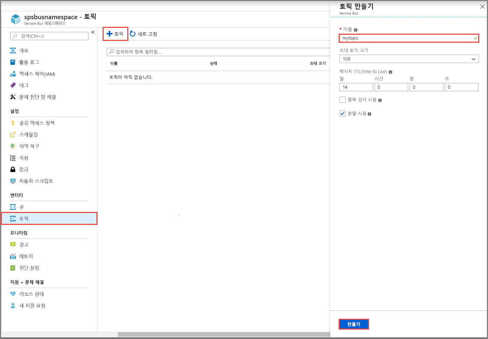
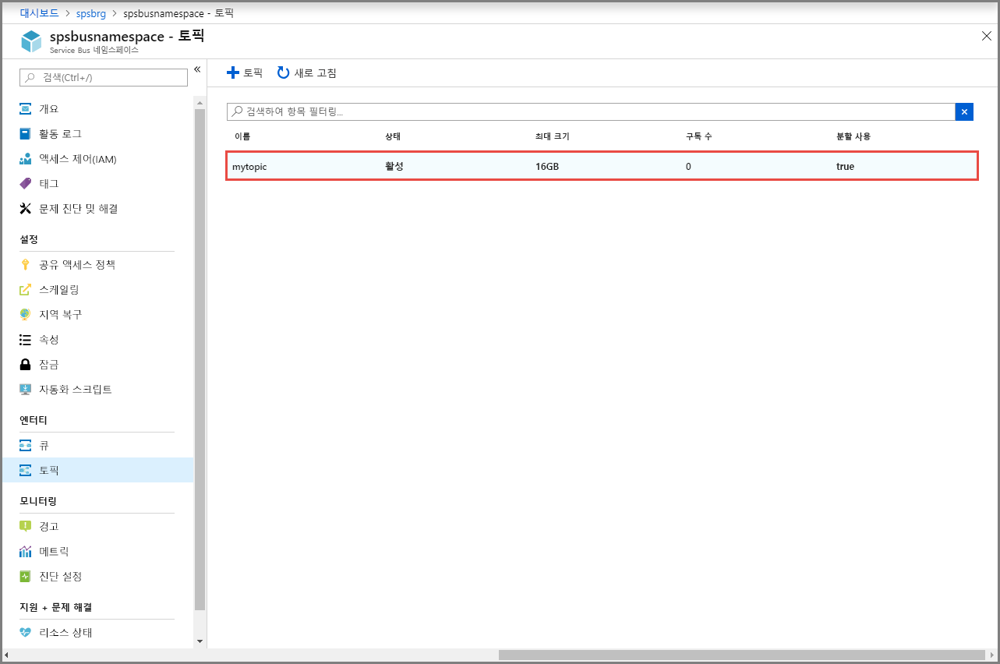

## Azure Portal을 사용하여 항목 만들기
1. **Service Bus 네임스페이스** 페이지의 왼쪽 메뉴에서 **항목**을 선택합니다.
2. 도구 모음에서 **+ 항목**을 선택합니다. 
4. 항목의 **이름**을 입력합니다. 다른 옵션은 기본값 그대로 둡니다.
5. **만들기**를 선택합니다.

    

## 항목에 대 한 구독 만들기
1. 이전 섹션에서 만든 **항목**을 선택합니다. 
    
    
2. **Service Bus 항목** 페이지의 왼쪽 메뉴에서 **구독**을 선택한 다음, 도구 모음에서 **+ 구독**을 선택합니다. 
    
    ![[구독 추가] 단추](./media/service-bus-create-topics-subscriptions-portal/add-subscription-button.png)
3. 에 **구독 만들기** 페이지에서 입력 **S1** 에 대 한 **이름** 구독을 선택 합니다 **만들기**합니다. 

    ![[구독 만들기] 페이지](./media/service-bus-create-topics-subscriptions-portal/create-subscription-page.png)
4. 이전 단계 라는 구독을 만들를 두 번 반복 **S2** 하 고 **S3**합니다.