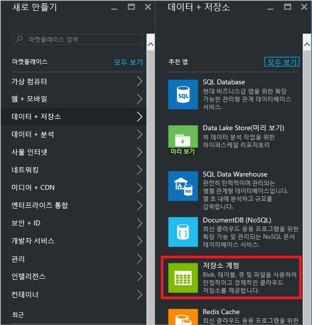
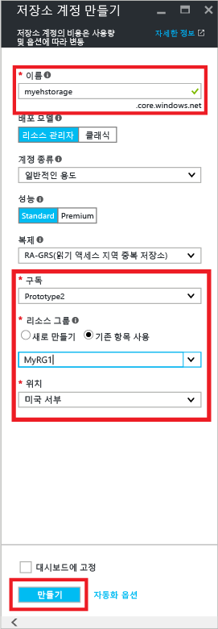
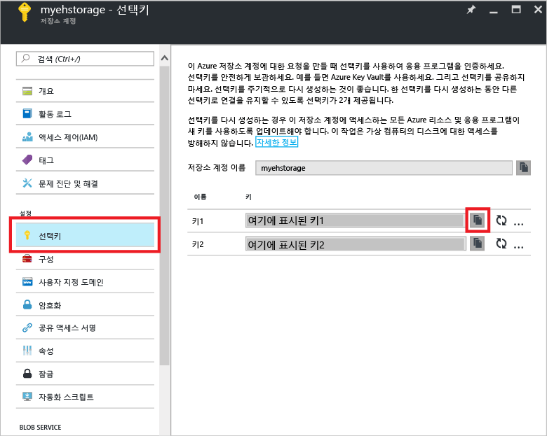
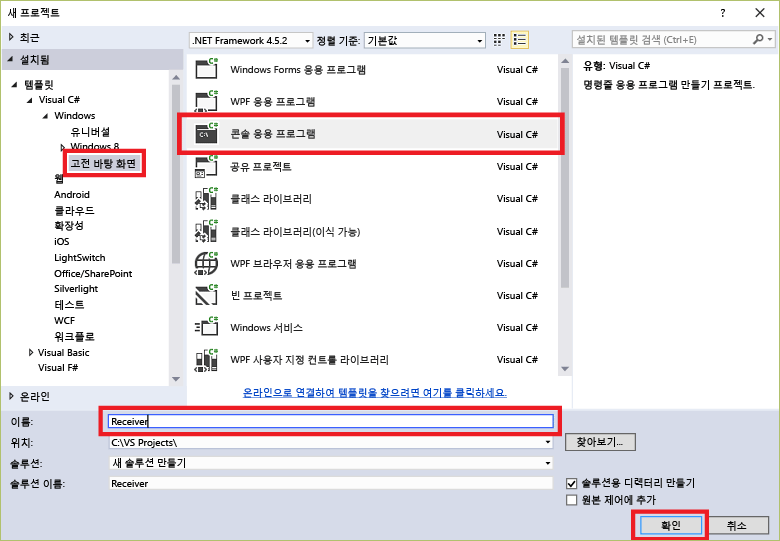
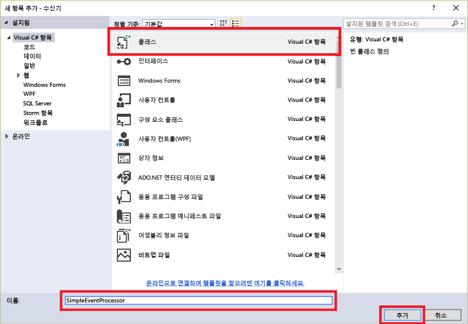

## EventProcessorHost를 사용하여 메시지 수신

[EventProcessorHost][]는 영구적 검사점을 관리하여 이벤트 허브의 이벤트 수신을 간소화하고 이러한 이벤트에서 병렬 수신하는 .NET 클래스입니다. [EventProcessorHost][]를 사용하면 다른 노드에 호스트된 수신기를 비롯한 여러 수신기 간에 이벤트를 분할할 수 있습니다. 이 예제에서는 단일 수신기에 대해 [EventProcessorHost][]를 사용하는 방법을 보여 줍니다. [확장된 이벤트 처리][] 샘플에서는 여러 수신기에서 [EventProcessorHost][]를 사용하는 방법을 보여 줍니다.

[EventProcessorHost][]를 사용하려면 [Azure Storage 계정][]이 있어야 합니다.

1. [Azure Portal][]에 로그온하고 화면 왼쪽 위에서 **새로 만들기**를 클릭합니다.

2. **데이터 + 저장소**를 클릭한 다음 **저장소 계정**을 클릭합니다.

    

3. **저장소 계정 만들기** 블레이드에서 저장소 계정의 이름을 입력합니다. 리소스를 만들 Azure 구독, 리소스 그룹 및 위치를 선택합니다. 그런 다음 **Create**를 클릭합니다.

    

4. 저장소 계정 목록에서 새로 만든 저장소 계정을 클릭합니다.

5. 저장소 계정 블레이드에서 **선택키**를 클릭합니다. 이 자습서에서 나중에 **key1** 값을 복사합니다.

	

4. Visual Studio에서 **콘솔 응용 프로그램** 프로젝트 템플릿을 사용하여 Visual C# 데스크톱 응용 프로그램 프로젝트를 새로 만듭니다. 프로젝트 이름을 **Receiver**로 지정합니다.

    

5. 솔루션 탐색기에서 솔루션을 마우스 오른쪽 단추로 클릭한 다음 **솔루션에 대한 NuGet 패키지 관리**를 클릭합니다.

6. **찾아보기** 탭을 클릭한 다음 `Microsoft Azure Service Bus Event Hub - EventProcessorHost`를 검색합니다. 프로젝트 이름(**수신기**)이 **버전** 상자에 지정되는지 확인합니다. **설치**를 클릭하고 사용 약관에 동의합니다.

    

	Visual Studio는 [Azure 서비스 버스 이벤트 허브 - EventProcessorHost NuGet 패키지](https://www.nuget.org/packages/Microsoft.Azure.ServiceBus.EventProcessorHost)에 대한 참조 및 해당하는 모든 종속성을 다운로드, 설치 및 추가합니다.

7. **Receiver** 프로젝트를 마우스 오른쪽 단추로 클릭하고 **추가**를 클릭한 후 **클래스**를 클릭합니다. 새 클래스의 이름을 **SimpleEventProcessor**로 지정하고 **추가**를 클릭하여 클래스를 생성합니다.

	

8. SimpleEventProcessor.cs 파일의 맨 위에 다음 구문을 추가합니다.

	```
	using Microsoft.ServiceBus.Messaging;
	using System.Diagnostics;
	```

	그런 다음 다음 코드를 클래스의 본문으로 대체합니다.

	```
    class SimpleEventProcessor : IEventProcessor
	{
	    Stopwatch checkpointStopWatch;

	    async Task IEventProcessor.CloseAsync(PartitionContext context, CloseReason reason)
	    {
	        Console.WriteLine("Processor Shutting Down. Partition '{0}', Reason: '{1}'.", context.Lease.PartitionId, reason);
	        if (reason == CloseReason.Shutdown)
	        {
	            await context.CheckpointAsync();
	        }
	    }

	    Task IEventProcessor.OpenAsync(PartitionContext context)
	    {
	        Console.WriteLine("SimpleEventProcessor initialized.  Partition: '{0}', Offset: '{1}'", context.Lease.PartitionId, context.Lease.Offset);
	        this.checkpointStopWatch = new Stopwatch();
	        this.checkpointStopWatch.Start();
	        return Task.FromResult<object>(null);
	    }

	    async Task IEventProcessor.ProcessEventsAsync(PartitionContext context, IEnumerable<EventData> messages)
	    {
	        foreach (EventData eventData in messages)
	        {
	            string data = Encoding.UTF8.GetString(eventData.GetBytes());

	            Console.WriteLine(string.Format("Message received.  Partition: '{0}', Data: '{1}'",
	                context.Lease.PartitionId, data));
	        }

	        //Call checkpoint every 5 minutes, so that worker can resume processing from 5 minutes back if it restarts.
	        if (this.checkpointStopWatch.Elapsed > TimeSpan.FromMinutes(5))
            {
                await context.CheckpointAsync();
                this.checkpointStopWatch.Restart();
            }
	    }
	}
    ```

	이 클래스는 이벤트 허브에서 받는 이벤트를 처리하기 위해 **EventProcessorHost**에서 호출합니다. `SimpleEventProcessor` 클래스는 초시계를 사용하여 **EventProcessorHost** 컨텍스트에서 검사점 메서드를 주기적으로 호출합니다. 따라서 수신기가 다시 시작되는 경우 5분 이하의 처리 작업은 손실됩니다.

9. **Program** 클래스에서 파일 맨 위에 다음 `using` 문을 추가합니다.

	```
	using Microsoft.ServiceBus.Messaging;
	```

	그런 다음 `Program` 클래스의 `Main` 메서드를 다음 코드로 바꾸고 이전에 저장한 이벤트 허브 이름 및 네임스페이스 수준 연결 문자열과 이전 섹션에서 복사한 저장소 계정 및 키를 대체합니다.

    ```
	static void Main(string[] args)
    {
      string eventHubConnectionString = "{Event Hub connection string}";
      string eventHubName = "{Event Hub name}";
      string storageAccountName = "{storage account name}";
      string storageAccountKey = "{storage account key}";
      string storageConnectionString = string.Format("DefaultEndpointsProtocol=https;AccountName={0};AccountKey={1}", storageAccountName, storageAccountKey);

      string eventProcessorHostName = Guid.NewGuid().ToString();
      EventProcessorHost eventProcessorHost = new EventProcessorHost(eventProcessorHostName, eventHubName, EventHubConsumerGroup.DefaultGroupName, eventHubConnectionString, storageConnectionString);
      Console.WriteLine("Registering EventProcessor...");
      var options = new EventProcessorOptions();
      options.ExceptionReceived += (sender, e) => { Console.WriteLine(e.Exception); };
      eventProcessorHost.RegisterEventProcessorAsync<SimpleEventProcessor>(options).Wait();

      Console.WriteLine("Receiving. Press enter key to stop worker.");
      Console.ReadLine();
      eventProcessorHost.UnregisterEventProcessorAsync().Wait();
    }
	```

> [AZURE.NOTE] 이 자습서에서는 [EventProcessorHost][]의 단일 인스턴스를 사용합니다. 처리량을 늘리려면 [EventProcessorHost][]의 여러 인스턴스를 사용하는 것이 좋습니다. [확장된 이벤트 처리 샘플][](영문)을 참조하세요. 이러한 경우 다양한 인스턴스가 자동으로 서로 조정되어 수신된 이벤트의 부하를 분산합니다. 여러 수신기가 각각 이벤트를 *모두* 처리하도록 하려면 **ConsumerGroup** 개념을 사용해야 합니다. 서로 다른 컴퓨터에서 이벤트를 수신하는 경우 [EventProcessorHost][] 인스턴스의 이름을 해당 인스턴스가 배포된 컴퓨터 또는 역할을 기준으로 지정하면 유용할 수 있습니다. 이러한 항목에 대한 자세한 내용은 [이벤트 허브 개요][] 및 [이벤트 허브 프로그래밍 가이드][]를 참조하세요.

<!-- Links -->
[이벤트 허브 개요]: event-hubs-overview.md
[이벤트 허브 프로그래밍 가이드]: event-hubs-programming-guide.md
[확장된 이벤트 처리]: https://code.msdn.microsoft.com/Service-Bus-Event-Hub-45f43fc3
[확장된 이벤트 처리 샘플]: https://code.msdn.microsoft.com/Service-Bus-Event-Hub-45f43fc3
[Azure Storage 계정]: ../storage/storage-create-storage-account.md
[EventProcessorHost]: http://msdn.microsoft.com/library/azure/microsoft.servicebus.messaging.eventprocessorhost(v=azure.95).aspx
[Azure portal]: https://portal.azure.com

<!---HONumber=AcomDC_0921_2016-->