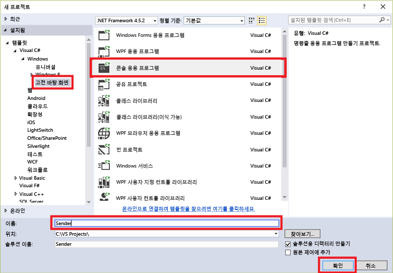

## 이벤트 허브에 메시지 보내기

이 섹션에서는 이벤트 허브로 이벤트를 보내는 Windows 콘솔 앱을 작성합니다.

1. Visual Studio에서 **콘솔 응용 프로그램** 프로젝트 템플릿을 사용하여 Visual C# 데스크톱 응용 프로그램 프로젝트를 새로 만듭니다. 프로젝트의 이름을 **Sender**로 지정합니다.

	

2. 솔루션 탐색기에서 솔루션을 마우스 오른쪽 단추로 클릭한 다음 **솔루션에 대한 NuGet 패키지 관리**를 클릭합니다.

3. **찾아보기** 탭을 클릭한 다음 `Microsoft Azure Service Bus`를 검색합니다. 프로젝트 이름(**보낸 사람**)이 **버전** 상자에 지정되는지 확인합니다. **설치**를 클릭하고 사용 약관에 동의합니다.

	

	Visual Studio는 [Azure 서비스 버스 라이브러리 NuGet 패키지](https://www.nuget.org/packages/WindowsAzure.ServiceBus)에 대한 참조를 다운로드, 설치 및 추가합니다.

4. **Program.cs** 파일 위에 다음 `using` 문을 추가합니다.

	```
	using System.Threading;
	using Microsoft.ServiceBus.Messaging;
	```

5. **Program** 클래스에 다음 필드를 추가하고, 이전 섹션에서 만든 이벤트 허브 이름과 이전에 저장한 네임스페이스 수준 연결 문자열로 위치 지정자 값을 대체합니다.

	```
	static string eventHubName = "{Event Hub name}";
	static string connectionString = "{send connection string}";
	```

6. **Program** 클래스에 다음 메서드를 추가합니다.

	```
	static void SendingRandomMessages()
	{
	    var eventHubClient = EventHubClient.CreateFromConnectionString(connectionString, eventHubName);
	    while (true)
	    {
	        try
	        {
	            var message = Guid.NewGuid().ToString();
	            Console.WriteLine("{0} > Sending message: {1}", DateTime.Now, message);
	            eventHubClient.Send(new EventData(Encoding.UTF8.GetBytes(message)));
	        }
	        catch (Exception exception)
	        {
	            Console.ForegroundColor = ConsoleColor.Red;
	            Console.WriteLine("{0} > Exception: {1}", DateTime.Now, exception.Message);
	            Console.ResetColor();
	        }

	        Thread.Sleep(200);
	    }
	}
	```

	이 메서드는 200ms 지연과 함께 이벤트 허브에 이벤트를 지속적으로 보냅니다.

7. 마지막으로 **Main** 메서드에 다음 줄을 추가합니다.

	```
	Console.WriteLine("Press Ctrl-C to stop the sender process");
	Console.WriteLine("Press Enter to start now");
	Console.ReadLine();
	SendingRandomMessages();
	```

<!---HONumber=AcomDC_0921_2016-->