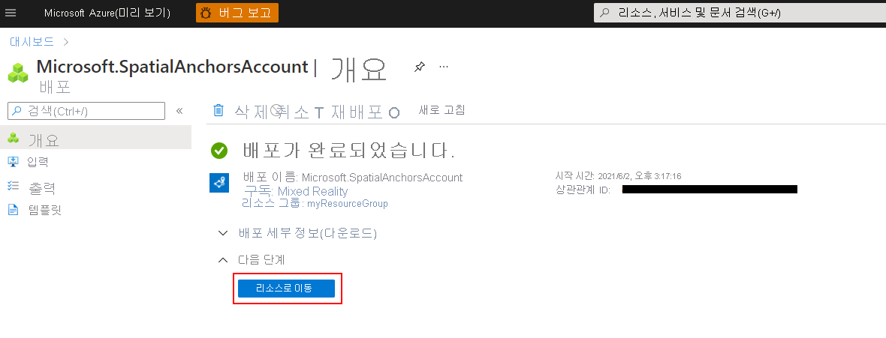
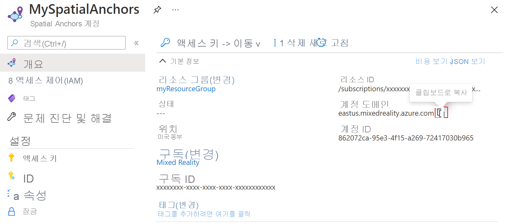

## Spatial Anchors 리소스 만들기

<a href="https://portal.azure.com" target="_blank">Azure 포털</a>로 이동합니다.

왼쪽 창에서 **리소스 만들기**를 선택합니다.

검색 상자를 사용하여 **Spatial Anchors**를 검색합니다.

**Spatial Anchors**를 선택한 다음, **만들기**를 선택합니다.

**Spatial Anchors 계정** 창에서 다음을 수행합니다.

* 일반 영숫자 문자를 사용하여 고유한 리소스 이름을 입력합니다.  
* 리소스를 연결할 구독을 선택합니다.  
* **새로 만들기**를 선택하여 리소스 그룹을 만듭니다. 이름을 **myResourceGroup**으로 지정한 다음, **확인**을 선택합니다.  

  [!INCLUDE [resource group intro text](resource-group.md)]
  
* 리소스를 배치할 위치(Azure 지역)를 선택합니다.  
* **새로 만들기**를 선택하여 리소스 만들기를 시작합니다.

리소스를 만든 후 Azure Portal은 배포가 완료되었음을 표시합니다. 
   

**리소스로 이동**을 선택합니다. 이제 리소스 속성을 볼 수 있습니다. 
   
나중에 사용하기 위해 리소스의 **계정 ID** 값을 텍스트 편집기에 복사합니다.

또한 리소스의 **계정 도메인** 값을 텍스트 편집기에 복사합니다.

**설정** 아래에서 **키**를 선택합니다. 나중에 사용하기 위해 **기본 키** 값, **계정 키**를 텍스트 편집기에 복사합니다.

