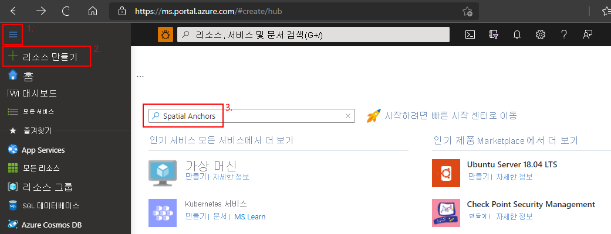
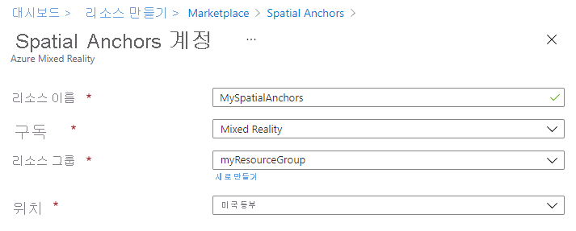
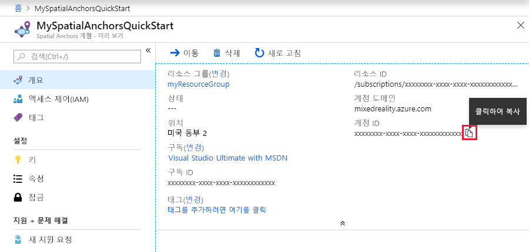

## Spatial Anchors 리소스 만들기

<a href="https://portal.azure.com" target="_blank">Azure 포털</a>로 이동합니다.

Azure Portal의 왼쪽 탐색 창에서 **리소스 만들기**를 선택합니다.

검색 상자를 사용하여 **Spatial Anchors**를 검색합니다.

   

**Spatial Anchors**를 선택합니다. 대화 상자에서 **만들기**를 선택합니다.

**Spatial Anchors 계정** 대화 상자에서 다음을 수행합니다.

- 고유한 리소스 이름을 입력합니다.
- 리소스를 연결할 구독을 선택합니다.
- **새로 만들기**를 선택하여 리소스 그룹을 만듭니다. 이름을 **myResourceGroup**으로 지정하고 **확인**을 선택합니다.
      [!INCLUDE [resource group intro text](resource-group.md)]
- 리소스를 배치할 위치(Azure 지역)를 선택합니다.
- **새로 만들기**를 선택하여 리소스 만들기를 시작합니다.

   

리소스가 만들어지면 리소스 속성을 볼 수 있습니다. 리소스의 **계정 ID** 값을 텍스트 편집기에 복사합니다. 나중에 필요합니다.

   

**설정** 아래에서 **키**를 선택합니다. **기본 키** 값을 텍스트 편집기에 복사합니다. 이 값은 `Account Key`입니다. 나중에 필요합니다.

   
