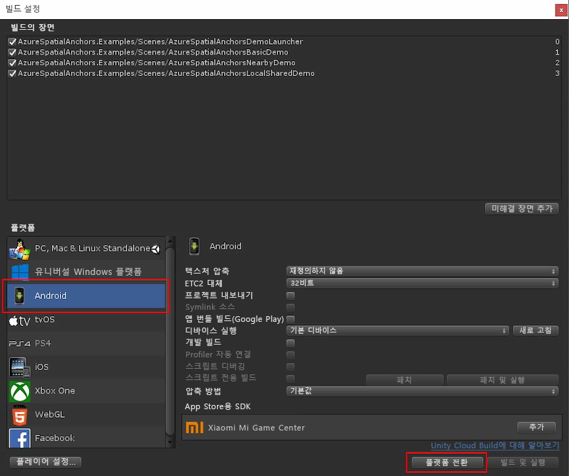

**파일** > **빌드 설정**을 선택하여 **빌드 설정**을 엽니다.

**플랫폼** 섹션에서 **Android**를 선택합니다. **빌드 시스템**을 **Gradle**로 변경하고 **프로젝트 내보내기**를 선택합니다.

**플랫폼 전환**을 선택하여 플랫폼을 **Android**로 변경합니다. Android 지원 구성 요소가 누락된 경우 Unity가 이러한 구성 요소를 설치하라고 요청할 수 있습니다.

**빌드 설정** 창을 닫습니다.

### Unity용 ARCore SDK 다운로드 및 가져오기

[Unity용 ARCore SDK 1.5 릴리스](https://github.com/google-ar/arcore-unity-sdk/releases/tag/v1.5.0)에서 `unitypackage` 파일을 다운로드합니다. Unity 프로젝트로 돌아가 **자산** > **패키지 가져오기** > **사용자 지정 패키지**를 선택한 다음, 이전에 다운로드한 `unitypackage` 파일을 선택합니다. **Unity 패키지 가져오기** 대화 상자에서 모든 파일을 선택한 다음, **가져오기**를 선택합니다.
