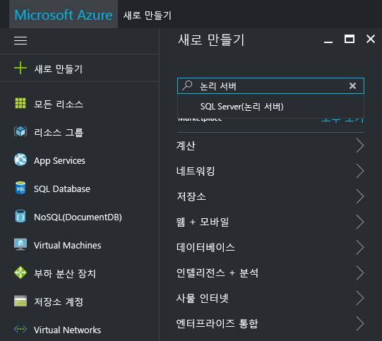
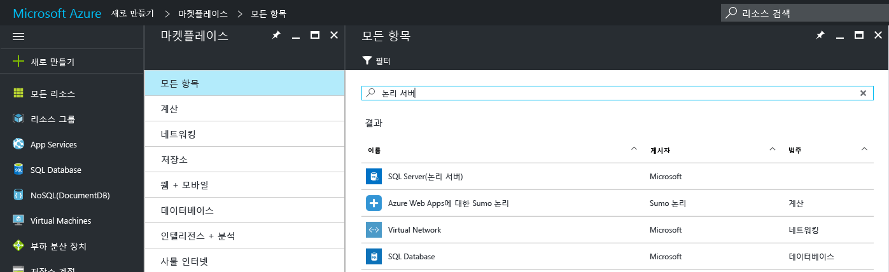
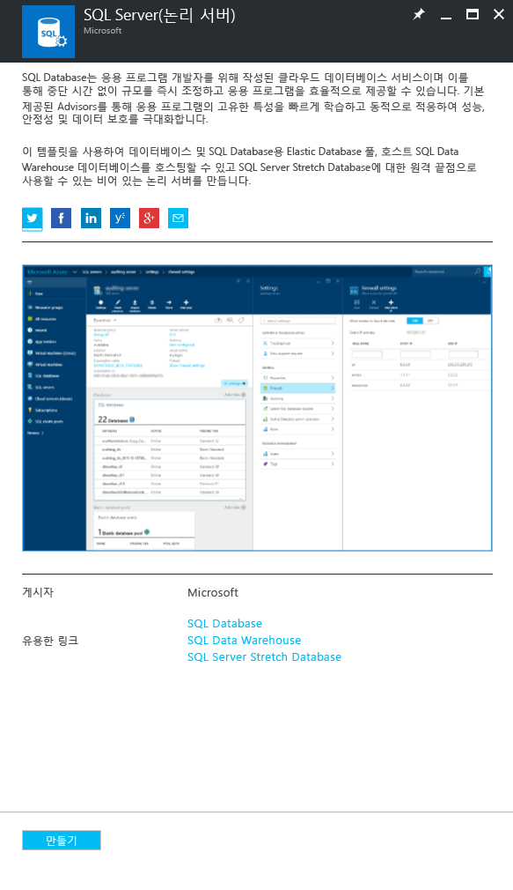
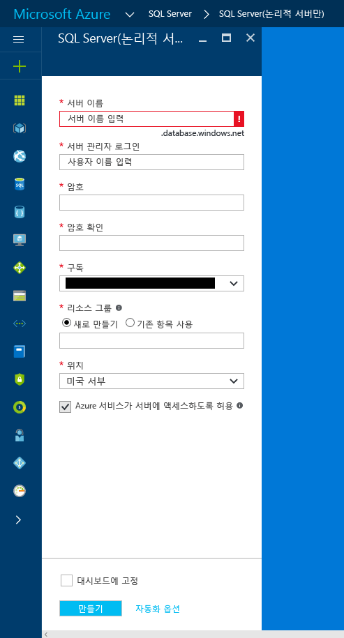
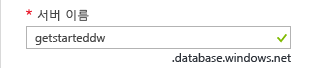
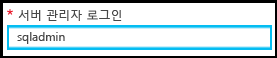
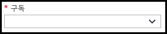
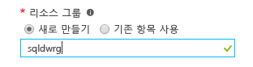
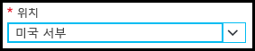

### Azure Portal에서 새 논리 SQL 서버 만들기

1. **새로 만들기**를 클릭하고 **논리 서버**를 검색한 다음 **Enter** 키를 누릅니다.

    
2. **SQL 서버(논리 서버)**를 선택합니다. 

    
  
3. **만들기**를 클릭하여 새 SQL Server(논리 서버) 블레이드를 엽니다.

   <kbd> </kbd>
    <kbd></kbd>
  
3. [SQL Server(논리 서버)] 블레이드의 서버 이름 텍스트 상자에서 새 논리 서버의 유효한 이름을 제공합니다. 녹색 확인 표시가 유효한 이름을 제공한 것을 나타냅니다.
    
    

    > [!IMPORTANT]
    > 새 서버의 정규화된 이름은 <your_server_name>.database.windows.net입니다.
    >
    
4. [서버 관리자 로그인] 텍스트 상자에서 이 서버의 SQL 인증 로그인을 위한 사용자 이름을 제공합니다. 이 로그인은 서버 보안 주체 로그인으로 알려져 있습니다. 녹색 확인 표시가 유효한 이름을 제공한 것을 나타냅니다.
    
    
5. **암호** 및 **암호 확인** 텍스트 상자에서 서버 보안 주체 로그인 계정에 대한 암호를 제공합니다. 녹색 확인 표시가 유효한 암호를 제공한 것을 나타냅니다.
    
    
6. 개체를 만들 수 있는 권한이 있는 구독을 선택합니다.

    
7. [리소스 그룹] 텍스트 상자에서 **새로 만들기**를 선택한 다음 [리소스 그룹] 텍스트 상자에서 새 리소스 그룹의 유효한 이름을 제공합니다. 이미 사용자 자신의 리소스 그룹을 만든 경우 기존 리소스 그룹을 사용할 수도 있습니다. 녹색 확인 표시가 유효한 이름을 제공한 것을 나타냅니다.

    

8. **위치** 텍스트 상자에서 위치에 적합한 데이터 센터(예: "오스트레일리아 동부")를 선택합니다.
    
    
    
    > [!TIP]
    > **Azure 서비스의 서버 액세스 허용** 확인란은 이 블레이드에서 변경할 수 없습니다. [서버 방화벽] 블레이드에서 이 설정을 변경할 수 있습니다. 자세한 내용은 [보안 시작](../articles/sql-database/sql-database-manage-servers-portal.md)을 참조하세요.
    >
    
9. **만들기**를 클릭합니다.

    

