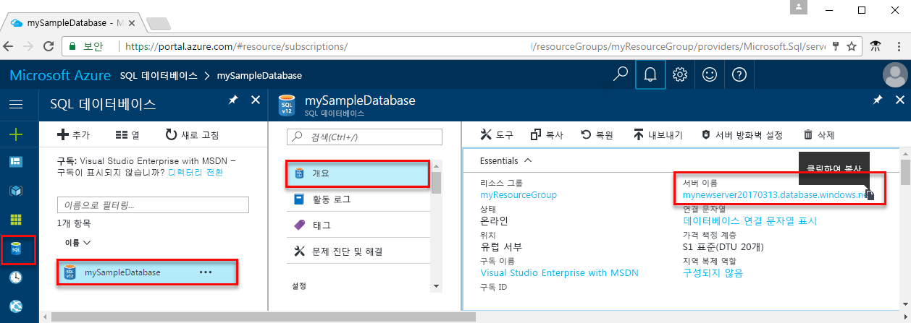

<!-- sql-database-connect-query-prerequisites-server-connection-info-includes.md 

## SQL server connection information
-->

Azure SQL Database에 연결하는 데 필요한 연결 정보를 가져옵니다. 다음 절차에는 정규화된 서버 이름, 데이터베이스 이름 및 로그인 정보가 필요합니다.

1. [Azure Portal](https://portal.azure.com/)에 로그인합니다.

1. 왼쪽 메뉴에서 **SQL Database**를 선택하고 **SQL Database** 페이지에서 데이터베이스를 클릭합니다.

1. 데이터베이스의 **개요** 페이지에서 다음 이미지와 같이 정규화된 서버 이름을 검토합니다. **서버 이름** 위로 마우스를 가져가면 **복사하려면 클릭** 옵션이 표시됩니다.  

   

1. 서버 로그인 정보를 잊어버린 경우 **서버 이름**을 클릭하여 **SQL 서버** 페이지로 이동하고 **서버 관리자** 이름을 확인할 수 있습니다. 필요할 경우 **암호 다시 설정**을 선택합니다.
