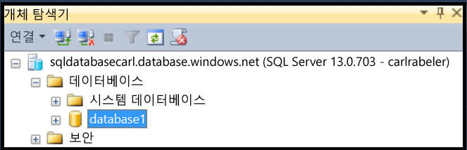
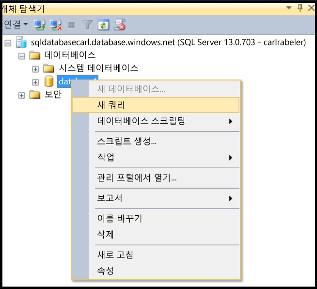
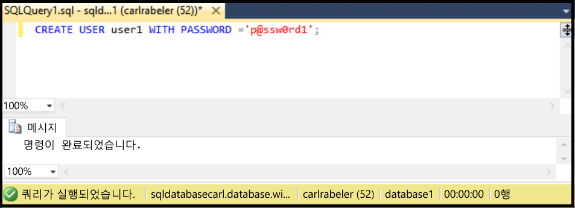

## <a name="create-new-database-user-using-ssms"></a>SSMS를 사용하여 새 데이터베이스 사용자 만들기
SSMS를 사용하여 기존 데이터베이스에서 새 데이터베이스 사용자를 만들려면 다음 단계를 사용합니다. 

이 단계는 사용자가 SSMS를 사용하여 개체 탐색기에 있는 SQL 데이터베이스에 연결되어 있으며 서버 수준 보안 주체 관리자 권한 또는 새 사용자를 만들 수 있는 권한이 있는 사용자 계정으로 SQL 데이터베이스 논리 서버에 연결되어 있다고 가정합니다. 

1. 개체 탐색기에서 데이터베이스 노드를 확장하고 새 사용자 계정을 만들려는 데이터베이스를 선택합니다.
   
     
2. 선택한 데이터베이스를 마우스 오른쪽 단추로 클릭한 다음 **쿼리**를 클릭합니다.
   
     
3. 쿼리 창에서 TRANSACT-SQL 문을 편집 및 사용하여 사용자 데이터베이스에 포함된 사용자를 만듭니다. 
   
    ```CREATE USER user1 WITH PASSWORD ='p@ssw0rd1';
    ```
   
     


<!--HONumber=Nov16_HO2-->


