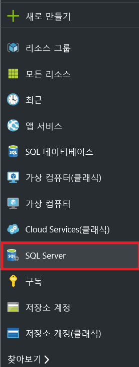
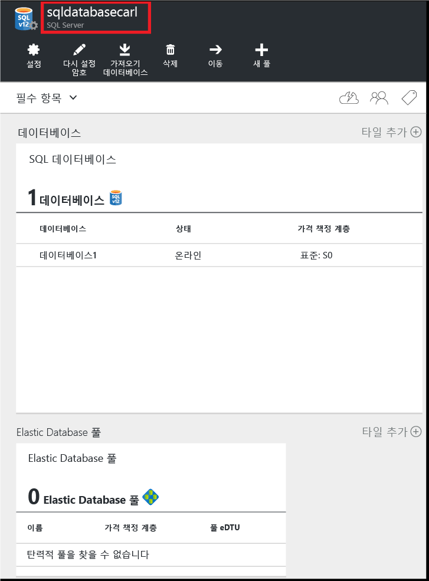
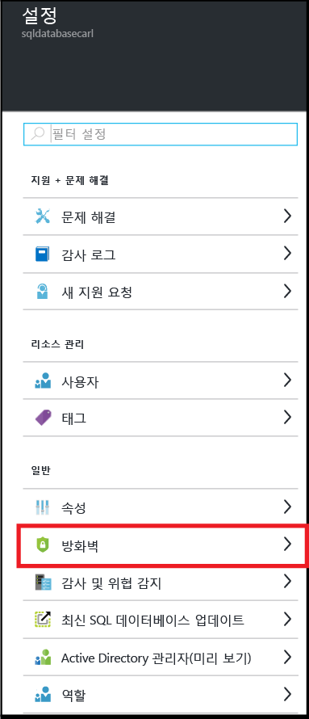
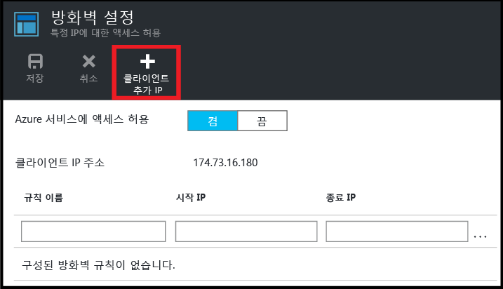
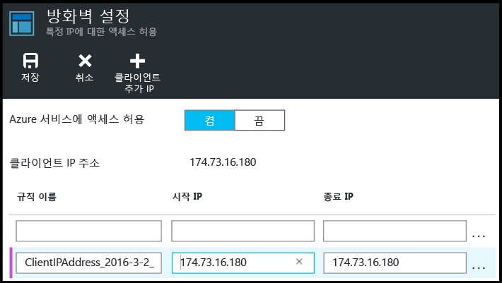
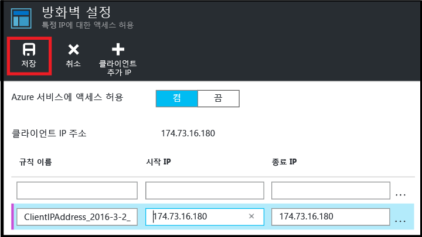

<!--
includes/sql-database-create-new-server-firewall-portal.md

Latest Freshness check:  2016-08-01 , rickbyh.

As of circa 2016-04-11, the following topics might include this include:
articles/sql-database/sql-database-get-started-tutorial.md
articles/sql-database/sql-database-configure-firewall-settings

-->
## 새 Azure SQL 서버 수준 방화벽 만들기
Azure 포털에서 다음 단계를 사용하여 (클라이언트 컴퓨터의)개별 IP 주소 또는 전체 IP 주소 범위에서 SQL 데이터베이스 논리 서버에 연결을 허용하는 서버 수준 방화벽 규칙을 만듭니다.

1. 연결되어 있지 않은 경우 [Azure Portal](http://portal.azure.com)에 연결합니다.
2. 기본 블레이드에서 **SQL Server**를 클릭합니다.
   
      
3. **SQL Server** 블레이드에서 방화벽 규칙을 만들 서버를 클릭합니다.
   
     
4. 서버의 속성을 검토합니다.
   
     
5. **설정** 블레이드에서 **방화벽**을 클릭합니다.
   
     
   
   > [!NOTE]
   > **데이터베이스** 블레이드의 도구 모음에서 서버 수준 **방화벽 설정** 블레이드에 액세스할 수도 있습니다.
   > 
   > 
6. **클라이언트 IP 추가** 를 클릭하여 Azure에서 클라이언트 IP 주소에 대한 규칙을 생성하도록 합니다.
   
      
7. 필요에 따라 IP 주소의 범위에 대한 액세스를 허용하려면 방화벽 주소를 편집하는 데 추가된 IP 주소를 클릭합니다.
   
      
8. **저장** 을 클릭하여 서버 수준 방화벽 규칙을 만듭니다.
   
     
   
   > [!IMPORTANT]
   > 클라이언트 IP 주소가 수시로 변경될 수 있으면 새 방화벽 규칙을 만들 때까지 서버에 액세스하지 못할 수 있습니다. [Bing](http://www.bing.com/search?q=my%20ip%20address)을 사용하여 IP 주소를 확인할 수 있습니다. 그런 다음 단일 IP 주소 또는 일정 범위의 IP 주소를 추가합니다. 자세한 내용은 [방화벽 설정 관리](../articles/sql-database/sql-database-configure-firewall-settings.md#manage-existing-server-level-firewall-rules-through-the-azure-portal)를 참조하세요.
   > 
   > 

<!--HONumber=Nov16_HO2-->

