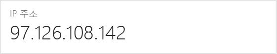

<!--
includes/sql-database-create-new-server-firewall-portal.md

Latest Freshness check:  2016-11-28 , rickbyh.

As of circa 2016-04-11, the following topics might include this include:
articles/sql-database/sql-database-get-started.md
articles/sql-database/sql-database-configure-firewall-settings
articles/sql-data-warehouse-get-started-provision.md

-->
## Azure Portal에서 서버 수준 방화벽 규칙 만들기

1. SQL 서버 블레이드의 [설정]에서 **방화벽**을 클릭하여 SQL 서버를 위한 [방화벽] 블레이드를 엽니다.

    
    
2. 표시된 클라이언트 IP 주소를 검토하고 선택한 브라우저를 사용하여 인터넷에서 사용자의 IP 주소인지 확인합니다("내 IP 주소는?"이라고 묻기). 때로는 여러 가지 이유로 일치하지 않습니다.

    

3. IP 주소가 일치한다고 가정하고 도구 모음에서 **클라이언트 IP 추가**를 클릭합니다.

    

    > [!NOTE]
    > 서버의 SQL Database 방화벽을 단일 IP 주소 또는 전체 주소 범위로 열 수 있습니다. 방화벽을 열면 SQL 관리자와 사용자가 유효한 자격 증명이 있는 서버의 데이터베이스에 로그인할 수 있습니다.
    >

4. 도구 모음에서 **저장**을 클릭하여 해당 서버 수준 방화벽 규칙을 저장한 다음 **확인**을 클릭합니다.

    

> [!Tip]
> 자습서에 대해서는 [SQL Database 자습서: 서버, 서버 수준 방화벽 규칙, 샘플 데이터베이스, 데이터베이스 수준 방화벽 규칙 및 SQL Server 연결 만들기](../articles/sql-database/sql-database-get-started.md)를 참조하세요.    
>

<!--HONumber=Jan17_HO1-->

