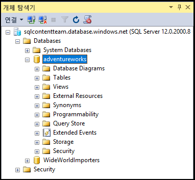

## 서버 수준 보안 주체 로그인을 사용하여 AzureSQL 데이터베이스에 연결

서버 수준 보안 주체 로그인을 사용하여 SSMS로 Azure SQL 데이터베이스에 연결하려면 다음 단계를 사용합니다.

1. Windows 검색 상자에 "Microsoft SQL Server Management Studio"를 입력한 다음 데스크톱 응용 프로그램을 클릭하여 SSMS를 시작합니다.

2. 서버에 연결 창에서 다음 정보를 입력합니다.

 - **서버 유형**: 기본값은 데이터베이스 엔진입니다. 이 값을 변경하지 마십시오.
 - **서버 이름**: *&lt;servername>*.**database.windows.net** 형식으로 SQL 데이터베이스를 호스팅하는 서버 이름을 입력합니다.
 - **인증 유형**: 방금 시작한 경우 SQL 인증을 선택합니다. SQL 데이터베이스 논리 서버에 Active Directory를 사용하는 경우 Active Directory 암호 인증 또는 Active Directory 통합 인증을 선택할 수 있습니다.
 - **사용자 이름**: SQL 인증 또는 Active Directory 암호 인증을 선택한 경우 서버의 데이터베이스에 대한 액세스로 사용자의 이름을 입력합니다.
 - **암호**: SQL 인증 또는 Active Directory 암호 인증을 선택한 경우 지정된 사용자에 대한 암호를 입력합니다.
   
       

3. **Connect**를 클릭합니다.
 
4. 클라이언트의 IP 주소에 SQL 데이터베이스 논리 서버에 대한 액세스가 없는 경우 Azure 계정에 로그인하고 서버 수준 방화벽 규칙을 만들라는 메시지가 표시됩니다. Azure 구독 관리자인 경우 **로그인**을 클릭하여 서버 수준 방화벽 규칙을 만듭니다. 그렇지 않은 경우 Azure 관리자 권한을 갖고 서버 수준 방화벽 규칙을 만듭니다.
 
      
 
1. Azure 구독 관리자이며 로그인이 필요한 경우 로그인 페이지가 나타나면 구독에 대한 자격 증명을 제공하고 로그인합니다.

      
 
1. Azure에 대한 로그인에 성공한 후 제안된 서버 수준 방화벽 규칙(IP 주소 범위를 허용하도록 수정할 수 있음)을 검토한 다음 **확인**을 클릭하여 방화벽 규칙을 만들고 SQL 데이터베이스에 연결을 완료합니다.
 
      
 
5. 자격 증명이 액세스를 부여하는 경우 개체 탐색기가 열리고 이제 관리 작업 또는 데이터 쿼리를 수행할 수 있습니다.
 
     
 
     
## 연결 오류 문제 해결

연결 실패에 대한 가장 일반적인 이유는 보안상의 이유로 연결을 허용하지 않도록 하는 서버와 서버 이름, 사용자 이름 또는 암호에 대한 실수입니다. <*servername*>은 데이터베이스가 아닌 논리적 서버의 이름임을 기억하세요.

<!---HONumber=AcomDC_0601_2016-->