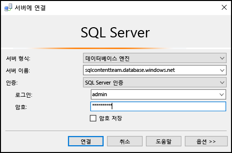
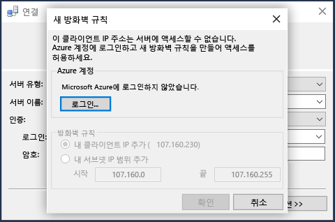

## SQL Server 인증을 사용하여 Azure SQL 데이터베이스에 연결
다음 단계에서는 SSMS를 사용하여 Azure SQL Server와 데이터베이스에 연결하는 방법을 보여 줍니다. 서버 및 데이터베이스가 없는 경우 만들려면 [몇 분 이내에 SQL 데이터베이스 만들기](../articles/sql-database/sql-database-get-started.md) 를 참조하세요.

1. Windows 검색 상자에 **Microsoft SQL Server Management Studio** 를 입력하여 SSMS를 시작한 다음 데스크톱 앱을 클릭합니다.
2. **서버에 연결** 창에 다음 정보를 입력합니다(SSMS가 이미 실행 중인 경우 **연결 > 데이터베이스 엔진**을 클릭하여 **서버에 연결** 창을 엽니다).
   
   * **서버 유형**: 기본값은 데이터베이스 엔진입니다. 이 값을 변경하지 마세요.
   * **서버 이름**: *&lt;servername>*.**database.windows.net** 형식으로 Azure SQL Database 서버의 정규화된 이름을 입력합니다.
   * **인증 형식**: 이 문서에서는 **SQL Server 인증**을 사용하여 연결하는 방법을 보여 줍니다. Azure Active Directory와 연결하는 방법에 대한 자세한 내용은 [Active Directory 통합 인증을 사용하여 연결](../articles/sql-database/sql-database-aad-authentication.md#connect-using-active-directory-integrated-authentication), [Active Directory 암호 인증을 사용하여 연결](../articles/sql-database/sql-database-aad-authentication.md#connect-using-active-directory-password-authentication) 및 [Active Directory 유니버설 인증을 사용하여 연결](../articles/sql-database/sql-database-ssms-mfa-authentication.md)을 참조하세요.
   * **사용자 이름**: 서버의 데이터베이스에 액세스 권한이 있는 사용자의 이름을 입력합니다(예: 서버를 만들 때 설정한 *서버 관리자* ). 
   * **암호**: 지정된 사용자에 대한 암호를 입력합니다(예: 서버를 만들 때 설정한 *암호* ).
     
       
3. **Connect**를 클릭합니다.
4. 기본적으로 새 서버에는 [방화벽 규칙](../articles/sql-database/sql-database-firewall-configure.md) 을 정의하지 않았으므로 클라이언트가 처음부터 연결하지 못하도록 차단됩니다. 서버에 연결할 특정 IP 주소를 허용하는 방화벽 규칙이 아직 없는 경우 SSMS에서는 서버 수준 방화벽 규칙을 만들라는 메시지가 표시됩니다.
   
    **로그인** 을 클릭하고 서버 수준 방화벽 규칙을 만듭니다. 서버 수준 방화벽 규칙을 만들려면 Azure 관리자여야 합니다.
   
       
5. Azure SQL 데이터베이스에 성공적으로 연결한 후에 **개체 탐색기** 가 열리면 이제 데이터베이스에 액세스하여 [관리 작업을 수행하거나 데이터를 쿼리](../articles/sql-database/sql-database-manage-azure-ssms.md)할 수 있습니다.
   
     

## 연결 오류 문제 해결
연결 실패가 일어나는 가장 일반적인 원인은 서버 이름과 네트워크 연결 문제에서 발생한 실수 때문입니다. <*servername*>은 데이터베이스가 아니라 서버 이름이고 정규화된 서버 이름을 제공해야 합니다. `<servername>.database.windows.net`

또한, 사용자 이름 및 암호에 입력 오류 또는 공백이 포함되지 않는지 확인합니다(사용자 이름은 대/소문자를 구분하지 않지만 암호는 구분함). 

다음과 같은 서버 이름을 가진 프로토콜 및 포트 번호를 명시적으로 설정할 수 있습니다. `tcp:servername.database.windows.net,1433`

네트워크 연결 문제는 연결 오류 및 시간 제한을 발생시킬 수 있습니다. (서버 이름, 자격 증명 및 방화벽 규칙이 올바른 경우)단순히 연결을 다시 시도하여 성공할 수 있습니다.

연결 문제에 대한 자세한 내용은 [SQL 연결 오류와 일시적 SQL Database 오류의 문제 해결, 진단 및 예방](../articles/sql-database/sql-database-connectivity-issues.md)을 참조하세요.

<!--HONumber=Nov16_HO2-->

