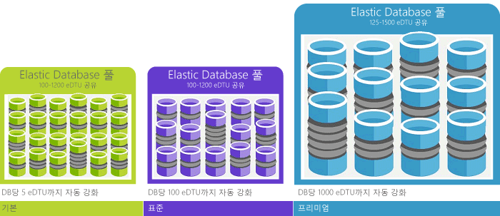

데이터베이스 트랜잭션 단위(DTU)는 SQL 데이터베이스에서 실제 측정: 데이터베이스 트랜잭션을 기반으로 데이터베이스의 상대적 위력을 보여 주는 측정 단위입니다. OLTP(온라인 트랜잭션 처리) 요청에 대표적인 작업 집합을 선택한 다음 완전히 로드된 상태에서 초당 완료할 수 있는 트랜잭션 수를 측정했습니다(이는 단축 버전이며, [벤치마크 개요](../articles/sql-database/sql-database-benchmark-overview.md)에서 복잡한 세부 정보를 읽을 수 있음).

예를 들어 1750 DTU를 사용하는 프리미엄 P11 데이터베이스는 5개의 DTU를 사용하는기본 데이터베이스보다 350배 더 많은 DTU 계산 기능을 제공합니다.

> [!NOTE]
> 기존 SQL Server 데이터베이스를 마이그레이션하는 경우 타사 도구인 [Azure SQL 데이터베이스 DTU 계산기](http://dtucalculator.azurewebsites.net/)를 사용하여 성능 수준을 추정할 수 있으며 서비스 계층 데이터베이스는 Azure SQL 데이터베이스에서 필요할 수 있습니다.
> 
> 

### DTU와 eDTU 비교
단일 데이터베이스에 대한 DTU는 탄력적 데이터베이스에 대한 eDTU로 직접 변환됩니다. 예를 들어 기본 탄력적 데이터베이스 풀의 데이터베이스는 최대 5개의 eDTUs를 제공합니다. 이는 단일 기본 데이터베이스와 같은 성능입니다. 차이점은 탄력적 데이터베이스가 필요할 때까지 풀에서 eDTUs를 사용하지 않는다는 것입니다.

참고로 간단한 예를 살펴보겠습니다. DTU가 1000개인 기본 탄력적 데이터베이스 풀을 선택하고 그 안에서 데이터베이스 800개를 삭제합니다. 어느 시점에 데이터베이스 800개 중 200개만 사용 중이라면(5 DTU X 200 = 1000) 풀의 용량에 도달하지 않으며 데이터베이스 성능이 저하되지 않습니다. 이 예제는 쉽게 이해할 수 있도록 단순화했습니다. 실제 수치는 좀더 복잡합니다. 포털이 수치 계산을 수행하며, 기록 데이터베이스 사용량을 기반으로 권장 사항을 제공합니다. 권장 사항의 작동 원리에 대해 알아보거나 직접 계산을 수행하려면 [탄력적 데이터베이스 풀에 대한 가격 및 성능 고려 사항](../articles/sql-database/sql-database-elastic-pool-guidance.md)을 참조하세요.

