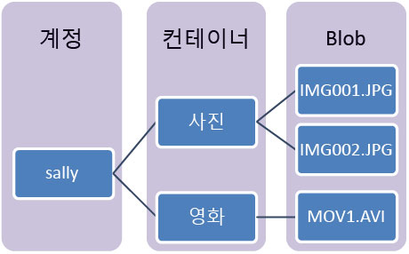

Azure Blob 저장소는 클라우드를 위한 Microsoft의 개체 저장소 솔루션입니다. Blob 저장소는 텍스트 또는 이진 데이터와 같이 구조화되지 않은 대량의 데이터를 저장하는 데 최적화되어 있습니다.

Blob 저장소는 다음에 이상적입니다.

* 브라우저에 이미지 또는 문서 직접 제공
* 분산 액세스용 파일 저장
* 동영상 및 오디오 스트리밍
* 로그 파일에 쓰기
* 백업/복원, 재해 복구 및 보관용 데이터 저장
* 온-프레미스 또는 Azure 호스티드 서비스에 의한 분석용 데이터 저장

사용자 또는 클라이언트 응용 프로그램은 URL, [Azure Storage REST API](https://docs.microsoft.com/rest/api/storageservices/blob-service-rest-api), [Azure PowerShell](https://docs.microsoft.com/powershell/module/azure.storage), [Azure CLI](https://docs.microsoft.com/cli/azure/storage) 또는 Azure Storage 클라이언트 라이브러리를 사용하여 &mdash;전 세계 어디서나&mdash; HTTP 또는 HTTPS를 통해 Blob Storage 개체에 액세스할 수 있습니다. 저장소 클라이언트 라이브러리는 [.NET](https://docs.microsoft.com/dotnet/api/overview/azure/storage/client), [Java](https://docs.microsoft.com/java/api/overview/azure/storage/client), [Node.js](http://azure.github.io/azure-storage-node), [Python](https://docs.microsoft.com/python/azure/), [PHP](http://azure.github.io/azure-storage-php/) 및 [Ruby](http://azure.github.io/azure-storage-ruby)를 비롯한 다양한 언어에서 사용할 수 있습니다.

## Blob service 개념

Blob Storage는 세 가지 리소스(저장소 계정, 계정의 컨테이너, 컨테이너의 BLOB)를 노출합니다. 다음 다이어그램에서는 이러한 리소스 간의 관계를 보여줍니다.

### Storage 계정

Azure Storage의 데이터 개체에 대한 모든 액세스는 저장소 계정을 통해 수행됩니다. 자세한 내용은 [Azure Storage 계정 개요](../articles/storage/common/storage-account-overview.md?toc=%2fazure%2fstorage%2fblobs%2ftoc.json)를 참조하세요.

### 컨테이너

컨테이너는 파일 시스템의 폴더와 비슷하게 BLOB 집합을 구성합니다. 모든 BLOB은 컨테이너에 상주합니다. 한 저장소 계정에 포함될 수 있는 컨테이너 수에 제한이 없으며, 컨테이너에 저장될 수 있는 Blob 수에도 제한이 없습니다. 

  > [!NOTE]
  > 컨테이너 이름은 소문자여야 합니다.

### Blob
 
Azure Storage는 &mdash;블록 Blob, 추가 Blob 및 [페이지 Blob](../articles/storage/blobs/storage-blob-pageblob-overview.md)(VHD 파일에 사용)의 세 가지 Blob 유형을 제공합니다.

* 블록 Blob은 텍스트 및 이진 데이터를 최대 약 4.7TB까지 저장합니다. 블록 Blob은 개별적으로 관리할 수 있는 데이터 블록으로 구성됩니다.
* 추가 Blob은 블록 Blob과 같이 블록으로 구성되지만 추가 작업에 최적화되어 있습니다. 추가 Blob은 가상 머신의 데이터 로깅 같은 시나리오에 적합합니다.
* 페이지 Blob은 임의 액세스 파일을 최대 8TB까지 저장합니다. 페이지 Blob은 VM을 백업하는 VHD 파일을 저장합니다.

모든 BLOB은 컨테이너에 상주합니다. 컨테이너는 파일 시스템의 폴더와 비슷합니다. BLOB을 가상 디렉터리에 추가로 정리하고 파일 시스템과 동일한 방법으로 탐색할 수 있습니다. 

대규모 데이터 세트 및 네트워크 제약 조건으로 인해 유선으로 Blob Storage에 데이터를 업로드할 수 없는 경우가 있을 수 있습니다. [Azure Data Box Disk](../articles/databox/data-box-disk-overview.md)를 사용하여 Microsoft의 SSD(Solid-State Disk)를 요청할 수 있습니다. 그런 다음, 해당 디스크에 데이터를 복사하고, Microsoft에 다시 제공하여 Blob Storage에 업로드할 수 있습니다.

저장소 계정에서 다량의 데이터를 내보내야 하는 경우 [Microsoft Azure Import/Export 서비스를 사용하여 Blob Storage로 데이터 전송](../articles/storage/common/storage-import-export-service.md)을 참조하세요.
  
컨테이너 및 Blob의 이름 지정에 대한 자세한 내용은 [컨테이너, Blob 및 메타데이터 명명 및 참조](/rest/api/storageservices/Naming-and-Referencing-Containers--Blobs--and-Metadata)를 참조하세요.
